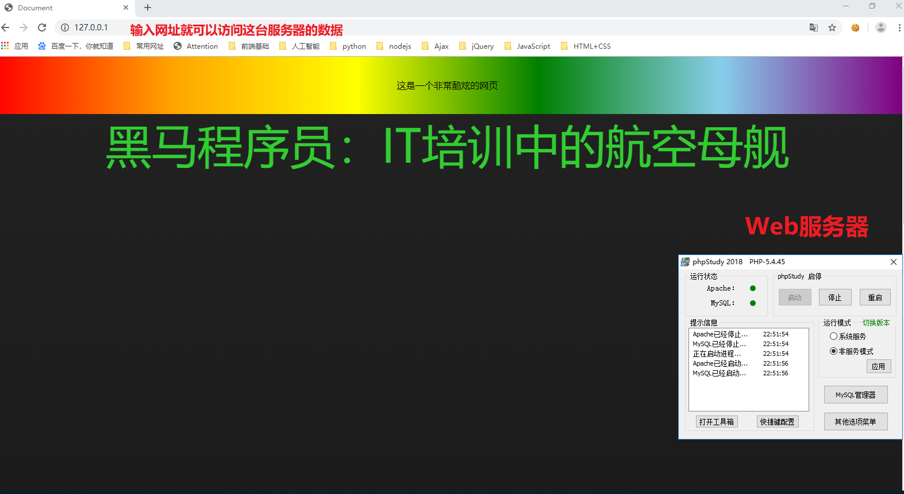
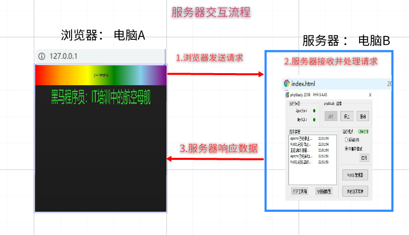
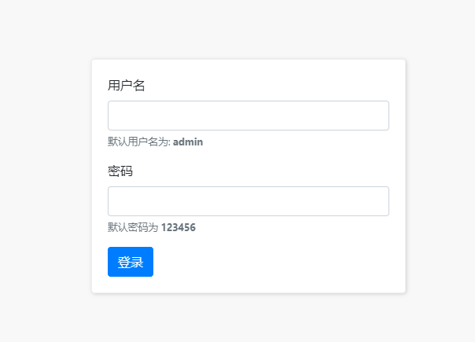

# 01-课程大纲介绍

## 1.1-Ajax是什么？

* Ajax就`是`让浏览器跟服务器交互的一套`API`。 它的作用就是可以让浏览器和服务器进行交互。
  * 说人话： ajax 是一种 用于`向服务器请求数据`的 技术
* MDN官网传送门:https://developer.mozilla.org/zh-CN/docs/Web/Guide/AJAX

## 1.2-学习Ajax的目标是什么？

* 学会使用ajax 根据 `接口文档` 和 服务器 `交互`
  * 目前，我们网页所有的数据都是写死的。实际开发中，网页的数据需要从服务器获取。而ajax技术就是来实现这一功能的。

## 1.3-如何学习Ajax


* 1.服务器了解
  * a. 什么是服务器
  * b.服务器的交互流程
* 2.ajax工作流程
* 3.可以使用ajax向服务器请求数据
* 4.ajax综合案例应用


# 02-服务器介绍


## 1.1-什么是服务器?

* 1.`服务器` 就`是`提供某种服务的 `电脑`(机器)
* 2.如何让电脑提供某种服务呢？`安装软件`
  * 想让你的电脑提供 `听歌` 服务，需要装什么软件呢？
    * 网易云、qq音乐
  * 想让你的电脑提供 `视频` 服务，需要装什么软件呢？
    * 爱奇艺，优酷
  * 想让你的电脑提供 `聊天` 服务，需要装什么软件呢？
    * qq，微信
* 3.综上所述，服务器就是某些安装了特殊软件，可以提供某些服务的电脑。常见的服务器有以下几种
  * 数据库服务
  * 文件服务
  * 多媒体服务(音视频)
  * 邮件服务
  * Web服务
* 4.要想让你的电脑成为一台Web服务器，我们只需要安装对应的软件即可。
  * 由于这些软件涉及的专业知识属于后台开发领域，我们的重点是了解什么是服务器，并且我们是前端开发，所以我们主要学习如何使用前端中的软件来和服务器进行交互。那么我们前端主要使用什么软件来和服务器进行交互呢？（Chrome）
* 


## 1.2-服务器交互流程

* 为什么刚刚我们只需要在浏览器输入一个网址点击回车之后就可以看到网页呢？
* 为什么我们修改了网页之后，需要在浏览器刷新以下才能看到最新的内容呢？
* 为什么在浏览器输入 <http://www.baidu.com>就可以看到百度网页呢？
* 为什么在浏览器输入 <http://www.jd.com>就可以看到京东网页呢？
* 其实，浏览器和服务器之间的每一次交互，都是由三个部分组成
  * 请求(浏览器发起请求，服务器接收)
  * 处理（服务器处理这个请求）
  * 响应（服务器响应数据给浏览器）




## 1.3-浏览器访问服务器的几种方式（代码01）

```html
<!DOCTYPE html>
<html lang="en">
<head>
    <meta charset="UTF-8">
    <meta name="viewport" content="width=device-width, initial-scale=1.0">
    <meta http-equiv="X-UA-Compatible" content="ie=edge">
    <title>Document</title>
    <style>
        
    </style>
</head>

<a href="http://192.168.137.1">点我跳转</a>
<button id="btn">点我也可以跳转哟</button>

<body>
    <script>
        /*几种访问服务器的方式
        1.直接在浏览器地址栏输入网址
        2.使用a标签的href属性
        3.使用window.location.href 
         */

        document.getElementById('btn').onclick = function(){
            window.location.href = 'http://192.168.137.1';
        };
    </script>
</body>
</html>
```


# ==03-ajax工作流程==

## 1.1-什么是ajax？

* ==ajax（阿贾克斯）：在不刷新页面的情况下向服务器请求数据==
  * [ajax技术真实网站介绍](https://www.smzdm.com/)
  * [ajax效果预览](file:///C:/Users/%E5%BC%A0%E6%99%93%E5%9D%A4/Desktop/%E5%BC%A0%E6%99%93%E5%9D%A4%E5%89%8D%E7%AB%AF%E5%A4%87%E8%AF%BE%E8%B5%84%E6%96%99/AB%E6%A8%A1%E5%BC%8F/06-Ajax/%E8%AF%BE%E7%A8%8B%E8%B5%84%E6%96%99/%E5%A4%87%E8%AF%BE%E4%BB%A3%E7%A0%81/day01/09-%E6%A1%88%E4%BE%8B%EF%BC%9A%E8%8B%B1%E9%9B%84%E6%9F%A5%E8%AF%A2.html)

## 1.2-为什么需要ajax？

* 1.以前我的写的页面全部都是固定的假数据，其实网页的数据都是从服务器获取的，一旦服务器数据变化，网页上的内容也会发生变化
* 2.虽然可以通过在浏览器地址栏直接输入网址（url）的方式向服务器获取数据，但是我们的网页会刷新
* 3.学会ajax：就可以做到在不刷新网页的情况下向服务器请求数据，让网站数据内容动态变化。


## ==1.3-ajax的工作流程(代码02)==

* 1.创建XMLHttpRequest对象（俗称小黄人）
  * `let xhr = new XMLHttpRequest();`
* 2.设置请求
  * `xhr.open('get', 'https://autumnfish.cn/api/joke');`
* 3.发送请求
  * `xhr.send();`
* 4.注册回调函数
  * * 这个函数不是立即执行的，而是等服务器把数据响应返回才会执行（PS：什么时候执行取决于你的网速快慢）
    * `xhr.onload = function () {console.log(xhr.responseText);}`


```html
<!DOCTYPE html>
<html lang="en">

<head>
    <meta charset="UTF-8">
    <meta name="viewport" content="width=device-width, initial-scale=1.0">
    <meta http-equiv="X-UA-Compatible" content="ie=edge">
    <title>Document</title>

    <script src="./jquery-1.12.4.min.js"></script>
</head>

<body>
    <script>
      
        /* 1.ajax： 在页面不刷新的情况下向服务器请求数据
           2.XMLHttpRequest ： http请求对象，负责实现ajax技术（小黄人）
                （1）创建XMLHttpRequest对象
                        * 小黄人，相当于黄袍加身的跑腿外卖小哥哥
                （2）设置请求
                        * 告诉小黄人服务器地址
                （3）发送请求
                        * 小黄人出发去指定地址取外卖（数据）
                            * 2G网速：走路去的
                            * 3G网速：骑膜拜去的
                            * WIFI : 骑电动车去的
                            * 4G   ： 骑小牛牌电动车去的
                （4）注册回调函数
                        * 小黄人把取回的外卖送到你家门口
        
         */

        //1.创建小黄人对象XMLHTTPRequest
        let xhr = new XMLHttpRequest();
        //2.设置请求
        xhr.open('get', 'https://autumnfish.cn/api/joke');
        //3.发送请求
        xhr.send();
        //4.注册回调函数
        /* 这个函数不是立即执行的，而是等服务器把数据响应返回才会执行（PS：什么时候执行取决于你的网速快慢） */
        xhr.onload = function () {
            console.log(xhr.responseText);
            document.body.innerText = xhr.responseText;
        };
    </script>
</body>

</html>
```


### 名词解释（课后了解）

* Ajax 即“**Asynchronous Javascript And XML**”（异步 JavaScript 和 XML），是指一种创建交互式网页应用的网页开发技术。                
* **说人话**：ajax就是一套可以让网站跟服务器交互的一种技术，能在我们需要时，不用再刷新网页就能去服务器要一些数据回来
* 例：http://www.smzdm.com 里只要网站往下滚动，就能不用刷新页面跟服务器要数据


## 1.4-案例：看笑话


```html
<!DOCTYPE html>
<html lang="en">
  <head>
    <meta charset="UTF-8" />
    <meta name="viewport" content="width=device-width, initial-scale=1.0" />
    <meta http-equiv="X-UA-Compatible" content="ie=edge" />
    <title>Document</title>
    <style>
      body {
        text-align: center;
      }

      input {
        border: 4px solid gray;
        padding: 10px;
        font-size: 25px;
        background-color: skyblue;
        color: white;
        border-radius: 10px;
        cursor: pointer;
        outline: none;
      }

      .joke-container {
        width: 500px;
        height: 500px;
        border: 1px solid gray;
        border-radius: 10px;
        padding-left: 10px;
        margin: 10px auto;
        font-size: 30px;
        text-align: left;
        text-indent: 60px;
      }
    </style>
  </head>

  <body>
    <input type="button" value="点我看笑话" class="getJoke" />
    <div class="joke-container"></div>

    <script src="./libs/jquery-1.12.4.min.js"></script>
    <script>
      /*
          随机获取笑话的接口
      
          - 请求地址：https://autumnfish.cn/api/joke
          - 请求方法：get
          - 请求参数：无
          - 响应内容：随机笑话
      
          思路步骤
      
          1. 给按钮注册点击事件 onclick
          2. 通过ajax调用 笑话接口
          3. 数据返回之后 显示到div中
       */
      document.querySelector(".getJoke").onclick = function() {
        // 1.创建小黄人对象
        let xhr = new XMLHttpRequest()
        // 2.设置请求的方法和地址
        xhr.open("get", "https://autumnfish.cn/api/joke")
        // 3.发送请求
        xhr.send()
        // 4.注册回调函数
        xhr.onload = function() {
          // console.log(xhr.responseText)
          // 显示到div中
          document.querySelector('.joke-container').innerText = xhr.responseText
        }
      }
    </script>
  </body>
</html>

```


# ==04-Ajax发送get请求与post请求==


## 1.1-get请求


```html
<!DOCTYPE html>
<html lang="en">
  <head>
    <meta charset="UTF-8" />
    <meta name="viewport" content="width=device-width, initial-scale=1.0" />
    <meta http-equiv="X-UA-Compatible" content="ie=edge" />
    <title>Document</title>
  </head>

  <body>
    <script>
      /*
        1.get传参格式： url?key=value
        2.示例： https://autumnfish.cn/api/joke/list?num=10
      */

      // 1.实例化ajax对象
      let xhr = new XMLHttpRequest()
      // 2.设置请求方法和地址
      // get请求的数据直接添加在url的后面 格式是 url?key=value
      xhr.open("get", "https://autumnfish.cn/api/joke/list?num=10")
      // 3.发送请求
      xhr.send()
      // 4.注册回调函数
      xhr.onload = function() {
        console.log(xhr.responseText)
      }
    </script>
  </body>
</html>

```

## 1.2-post请求


```html
<!DOCTYPE html>
<html lang="en">
  <head>
    <meta charset="UTF-8" />
    <meta name="viewport" content="width=device-width, initial-scale=1.0" />
    <meta http-equiv="X-UA-Compatible" content="ie=edge" />
    <title>Document</title>
  </head>

  <body>
    <script>
      /* 
        请求方法get和post区别： 传参方式不同
            get请求： 直接在url后面拼接参数
                * 参数在url中，安全性不高
            post请求：
                1.需要设置请求头（固定语法）：xhr.setRequestHeader('Content-type','application/x-www-form-urlencoded')
                    * 注意：这是固定格式，错一个字母都不行，强烈建议复制粘贴
                2.使用xhr的send方法发送参数： xhr.send('参数名=参数值');
                    * 注意：不要加前面的? 
      */
     
      //(1).实例化ajax对象
      let xhr = new XMLHttpRequest()
      //(2).设置请求方法和地址
      xhr.open("post", "https://autumnfish.cn/api/user/register")
      //(3).设置请求头（post请求才需要设置）
      xhr.setRequestHeader("Content-type", "application/x-www-form-urlencoded")
      //(4).发送请求 ： 参数格式  'key=value'
      xhr.send("username=admin")
      //(5).注册回调函数
      xhr.onload = function() {
        console.log(xhr.responseText)
      }
    </script>
  </body>
</html>

```


# 05-综合案例



## 1.1-用户登录

```html
<!DOCTYPE html>
<html lang="en">
  <head>
    <meta charset="UTF-8" />
    <meta http-equiv="X-UA-Compatible" content="IE=edge" />
    <meta name="viewport" content="width=device-width, initial-scale=1.0" />
    <title>Document</title>
    <link rel="stylesheet" href="./css/bootstrap-v4.6.0.css" />
    <link rel="stylesheet" href="./css/login.css" />
  </head>

  <body>
    <div class="login-box">
      <div class="form-group">
        <label for="username">用户名</label>
        <!-- 账号 -->
        <input
          type="text"
          class="form-control"
          id="username"
          autocomplete="off"
        />
        <small id="emailHelp" class="form-text text-muted"
          >默认用户名为:
          <strong>admin</strong>
        </small>
      </div>
      <div class="form-group">
        <!-- 密码 -->
        <label for="password">密码</label>
        <input type="text" class="form-control" id="password" />
        <small id="emailHelp" class="form-text text-muted"
          >默认密码为
          <strong>123456</strong>
        </small>
      </div>
      <button type="submit" class="btn btn-primary" id="btnLogin">登录</button>
    </div>

    <script>
      /* 思路分析:交互
		  1.点击登录按钮
			  1.1 获取用户输入的文本
			  1.2 ajax发送post请求
			  1.3 服务器响应数据
				code:200  成功，跳转首页
				code:500  失败，弹窗提示用户
		  */

      // 登录功能
      document.querySelector("#btnLogin").onclick = function() {
        //1.1 获取用户输入的文本
        let username = document.querySelector("#username").value
        let password = document.querySelector("#password").value
        //1.2 ajax发送post请求
        //(1).实例化ajax对象
        let xhr = new XMLHttpRequest()
        //(2).设置请求方法和地址
        xhr.open("post", "http://www.liulongbin.top:3009/api/login")
        //(3).设置请求头（post请求才需要设置）
        xhr.setRequestHeader(
          "Content-type",
          "application/x-www-form-urlencoded"
        )
        //(4).发送请求 ： 参数格式  'key=value'
        xhr.send(`username=${username}&password=${password}`)
        //(5).注册回调函数
        xhr.onload = function() {
          //1.3 服务器响应数据 （需要解析json->js）
          let res = JSON.parse(xhr.responseText)
          console.log(res)
          if (res.code == 500) {
            alert(res.msg)
          } else {
            alert("登录成功")
            location.href = "http://www.baidu.com"
          }
        }
      }
    </script>
  </body>
</html>

```


## 1.2-新闻列表


```html
<!DOCTYPE html>
<html lang="en">

<head>
  <meta charset="UTF-8" />
  <meta name="viewport" content="width=device-width, initial-scale=1.0" />
  <meta http-equiv="X-UA-Compatible" content="ie=edge" />
  <title>Document</title>
  <!-- 导入样式表 -->
  <link rel="stylesheet" href="./css/news.css" />
</head>

<body>

  <!-- 新闻列表 -->
  <div id="news-list">
    <!-- 新闻的 item 项 -->
    <div class="news-item">
      
      <div class="right-box">
        <!-- 新闻标题 -->
        <h1 class="title">5G商用在即，三大运营商营收持续下降</h1>
        <div class="footer">
          <div>
            <!-- 新闻来源 -->
            <span>胡润百富</span>&nbsp;&nbsp;
            <!-- 发布日期 -->
            <span>2019-10-28 10:14:38</span>
          </div>
          <!-- 评论数量 -->
          <span>评论数：66</span>
        </div>
      </div>
    </div>
  </div>

 
  <script>
    /* 思路分析
    1.请求数据(页面一加载，立刻获取数据，不需要事件的触发)
    2.渲染结构
    */

    // 1.请求数据(页面一加载，立刻获取数据，不需要事件的触发)
    //(1).实例化ajax对象
    let xhr = new XMLHttpRequest()
    //(2).设置请求方法和地址
    //get请求的数据直接添加在url的后面 格式是 url?key=value
    xhr.open('get', 'http://www.liulongbin.top:3009/api/news')
    //(3).发送请求
    xhr.send()
    //(4).注册回调函数
    xhr.onload = function() {
      //4.1 服务器返回JSON -> JS对象
      let res = JSON.parse(xhr.responseText)
      console.log(res)
      //4.2  渲染页面
      renderData(res.data)
    }

    /* 将数据渲染到页面有两种方式
      第一种：DOM驱动。  
        方式: 遍历数组,创建元素添加到页面
        弊端: DOM操作比较繁琐
      第二种: 数据驱动。 
        方式: 将数组 隐射成 html字符串，直接替换元素innerHTML
        好处: 无需操作DOM,只需要操作数据即可
    */
    

    //第一种： DOM驱动。webapi阶段的方式,今后不再使用
    function renderDom(arr){
      for(let i = 0;i<arr.length;i++){
        //(1)创建元素
        let div = document.createElement('div')
        //(2)设置内容
        div.innerHTML = `<div class="news-item">
        
        <div class="right-box">
        <!-- 新闻标题 -->
        <h1 class="title">${arr[i].title}</h1>
        <div class="footer">
          <div>
            <!-- 新闻来源 -->
            <span>${arr[i].source}</span>&nbsp;&nbsp;
            <!-- 发布日期 -->
            <span>${arr[i].time}</span>
          </div>
          <!-- 评论数量 -->
          <span>评论数：${arr[i].cmtcount}</span>
        </div>
        </div>
        </div>`
        //(3)添加到页面
        document.querySelector('#news-list').appendChild(div)
      }
    }


    //第二种: 数据驱动。 今后学习和开发推荐方式
    const renderData = arr=>{
      document.querySelector('#news-list').innerHTML = arr.map(item=>{
        return `<div class="news-item">
        
        <div class="right-box">
        <!-- 新闻标题 -->
        <h1 class="title">${item.title}</h1>
        <div class="footer">
          <div>
            <!-- 新闻来源 -->
            <span>${item.source}</span>&nbsp;&nbsp;
            <!-- 发布日期 -->
            <span>${item.time}</span>
          </div>
          <!-- 评论数量 -->
          <span>评论数：${item.cmtcount}</span>
        </div>
        </div>
        </div>`
      }).join('')
    }

  </script>
</body>

</html>
```


## 1.3-水果列表


```html
<!DOCTYPE html>
<html lang="en">
  <head>
    <meta charset="UTF-8" />
    <meta http-equiv="X-UA-Compatible" content="IE=edge" />
    <meta name="viewport" content="width=device-width, initial-scale=1.0" />
    <link rel="stylesheet" href="./css/inputnumber.css" />
    <link rel="stylesheet" href="./css/index.css" />
    <title>水果列表</title>
  </head>

  <body>
    <div class="app-container" id="app">
      <!-- 顶部banner -->
      <div class="banner-box"></div>
      <!-- 面包屑 -->
      <div class="breadcrumb">
        <span>🏠</span>
        /
        <span>水果列表</span>
      </div>
      <!-- table -->
      <div class="main">
        <div class="table">
          <!-- 头部 -->
          <div class="thead">
            <div class="tr">
              <div class="th">名字</div>
              <div class="th">图片</div>
              <div class="th">简介</div>
              <div class="th">操作</div>
            </div>
          </div>
          <div class="tbody">
            <div class="tr">
              <div class="td">火龙果</div>
              <div class="td">
                
              </div>
              <div class="td">
                <span class="my-input__inner count">一种好吃的水果</span>
              </div>
              <div class="td">
                <button class="info">查看详情</button>
              </div>
            </div>
          </div>
        </div>
      </div>
    </div>

    <script>
      /* 思路分析
      1.页面一加载,发送ajax请求
      2.服务器响应数据,渲染到页面
      */

      //(1).实例化ajax对象
      let xhr = new XMLHttpRequest()
      //(2).设置请求方法和地址
      //get请求的数据直接添加在url的后面 格式是 url?key=value
      xhr.open("get", "https://autumnfish.cn/fruitApi/fruits")
      //(3).发送请求
      xhr.send()
      //(4).注册回调函数
      xhr.onload = function() {
        // 4.1 将JSON ——> JS对象
        let res = JSON.parse(xhr.responseText)
        console.log(res)
        // 4.2 渲染页面
        renderData(res.data)
      }

      /* 将数据渲染到页面有两种方式
      第一种：DOM驱动。  
        方式: 遍历数组,创建元素添加到页面
        弊端: DOM操作比较繁琐
      第二种: 数据驱动。 
        方式: 遍历数组,拼接html字符串直接替换innerHTML
        好处: 无需操作DOM,只需要操作数据即可
      */
      const renderData = arr => {
        document.querySelector(".tbody").innerHTML = arr.map(item => {
          return `<div class="tr">
              <div class="td">${item.name}</div>
              <div class="td">
                
              </div>
              <div class="td">
                <span class="my-input__inner count">${item.info}</span>
              </div>
              <div class="td">
                <button class="info">查看详情</button>
              </div>
            </div>`
          }).join("")
      }
    </script>
  </body>
</html>

```


# 今日接口文档

## 1.1-什么是接口文档

* 1.接口：Web服务器提供的，让ajax请求的网络地址称之为接口，简称API

* 2.接口文档 ：为了方便开发人员使用，我们的后台小伙伴会提供一种专门的文档，称之为接口文档
  
  * 接口文档，又称为API文档，可以理解为接口的`使用说明书`
    * 接口文档的本质 ：其实就是后台开发（如php）他们写的函数注释。后台在处理请求的时候一般都会写一些函数
  
* 3.一个标准的接口文档至少要包含以下三种信息（`只能多，不能少`）
  
  * a.请求的地址 （url）
  * b.请求的方法 （get或者post）
  * c.请求的参数
  
* 4.以下是我们这个阶段可能会用到的接口文档，实际开发中为了避免你的`url地址`，`方法`,`参数`写错，一般强烈建议直接`复制粘贴`

## 1.2-接口文档示例

* 这个网站可以找到更多接口：https://github.com/AutumnFish/testApi

### 1.随机获取笑话的接口

* 请求地址：<https://autumnfish.cn/api/joke>
* 请求方法：get
* 请求参数：无
* 响应内容：随机笑话

### 2.获取多条随机笑话

> 随机获取笑话的接口

* 请求地址：https://autumnfish.cn/api/joke/list

* 请求方法：get

* 请求参数：num

  * 示例：https://autumnfish.cn/api/joke/list?num=10

  | 参数名 | 参数说明 | 备注                  |
  | ------ | -------- | --------------------- |
  | num    | 笑话条数 | 类型为数字,不要给错了 |

* 响应内容：JSON


### 3.用户注册

> 注册用户

* 请求地址：https://autumnfish.cn/api/user/register
* 请求方法：post
* 请求参数：username

| 参数名   | 参数说明 | 备注                                          |
| -------- | -------- | --------------------------------------------- |
| username | 用户名   | 不能为空,通过 send 方法传递，格式为 key=value |

```
xhr.send('username=xxx')
```

* 响应内容：注册成功或失败


### 4.用户登录

* 请求地址：http://www.liulongbin.top:3009/api/login
* 请求方法：post
* 请求参数：username  password

| 参数名   | 参数说明 | 备注                  |
| -------- | -------- | --------------------- |
| username | 用户名   | 不能为空,默认为admin  |
| password | 密码     | 不能为空,默认为123456 |

```
xhr.send('username=xxx&password=xxx')
```

* 响应内容：登录成功{code:200}  登录失败{code:500}


### 5.新闻列表

* 请求地址：http://www.liulongbin.top:3009/api/news
* 请求方法：get
* 请求参数：

* 响应内容：json数据


### 6.水果列表

* 请求地址：https://autumnfish.cn/fruitApi/fruits
* 请求方法：get
* 请求参数：

* 响应内容：json数据