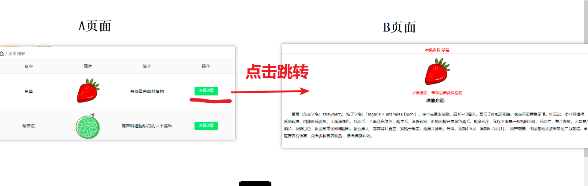
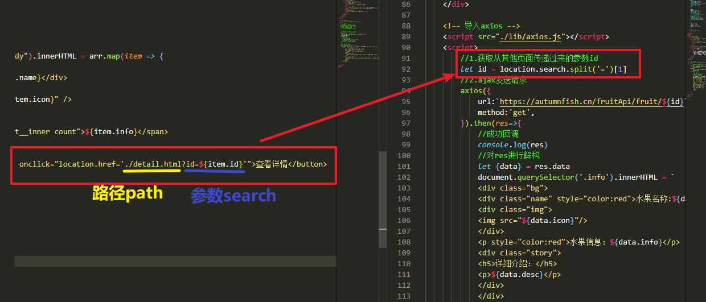
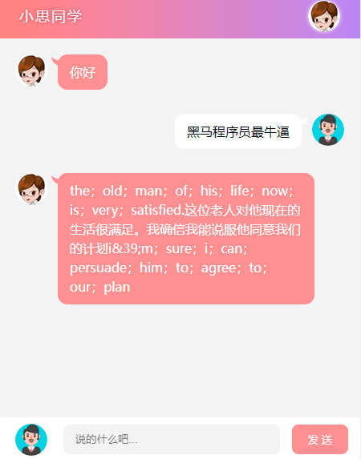
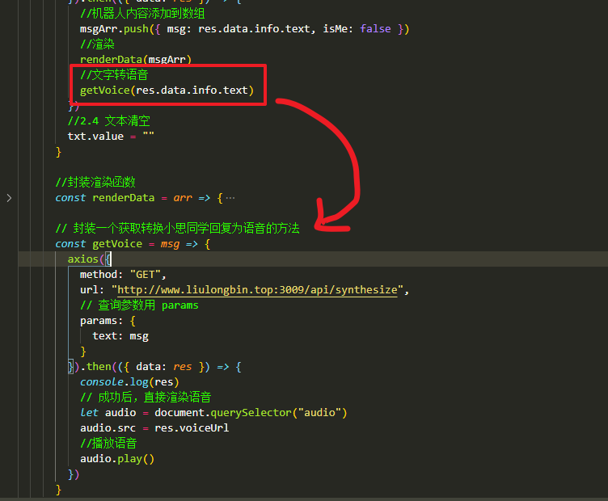
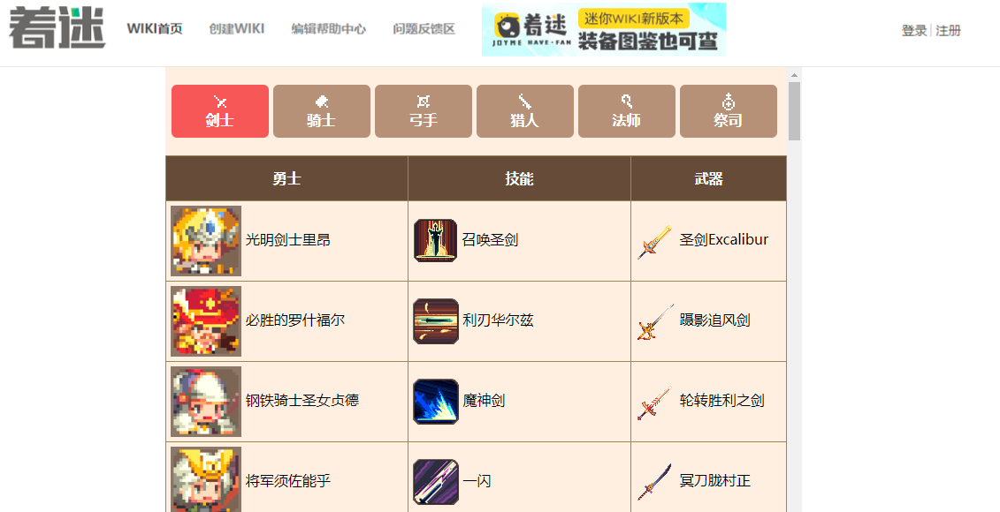
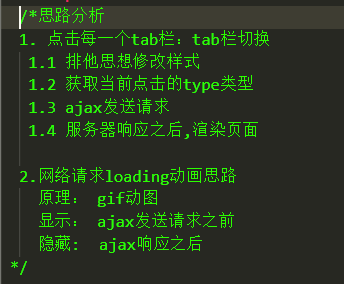

# ==01-axios框架使用==


* axios(阿克休斯) 官网 : http://www.axios-js.com/

* 1. axios是什么 ：  一个js框架，用于发送ajax请求（底层使用XMLHttpRequest）

* 2. 为什么要学习axios :  （1）后面vue课程，我们使用axios发送ajax请求 （2）大家今后实际开发也是使用axios发送ajax请求

  

## 1.1-axios基本使用

* 官网文档：http://www.axios-js.com/zh-cn/docs/

  

```html
<!DOCTYPE html>
<html lang="en">
  <head>
    <meta charset="UTF-8" />
    <meta name="viewport" content="width=device-width, initial-scale=1.0" />
    <meta http-equiv="X-UA-Compatible" content="ie=edge" />
    <title>Document</title>
  </head>

  <body>
    <button class="btn1">基本使用</button>
    <button class="btn2">点我发送get请求</button>
    <button class="btn3">点我发送post请求</button>

    <!-- 导入axios -->
    <script src="./axios.js"></script>
    <script>
      //基本使用
      document.querySelector(".btn1").onclick = function() {
        /* 
        get() : 写url和请求参数
        then(res=>{}) : 成功回调， 相当于以前jq的success
        catch(err=>{}):失败回调，   一般可以省略不写
        then(()=>{}):完成回调，  表示请求完成，无论成功失败都会执行。一般可以省略不写
        */
        axios
          .get("https://autumnfish.cn/api/joke/list?num=10")
          .then(res => {
            //请求成功
            console.log(res)
          })
          .catch(err => {
            //请求失败 : (1)网址写错了  (2)网络出问题了
            console.log(err)
          })
          .then(() => {
            //请求完成
            console.log("本次请求完成")
          })
      }

      //get请求
      document.querySelector(".btn2").onclick = function() {
        //get方法第一个参数是url
        //get方法第二个参数是对象类型  { params:{get参数对象}  }
        axios
          .get("https://autumnfish.cn/api/joke/list", {
            params: {
              num: 10
            }
          })
          .then(res => {
            //请求成功
            console.log(res)
          })
      }

      //post请求
      document.querySelector(".btn3").onclick = function() {
        //post方法第一个参数是url
        //post方法第二个参数是对象类型  { post参数对象  }
        axios
          .post("http://www.liulongbin.top:3009/api/login", {
            username: "admin",
            password: "123456"
          })
          .then(res => {
            //请求成功
            console.log(res)
          })
          .catch(err => {
            //请求失败
            console.log(err)
          })
      }
    </script>
  </body>
</html>

```


## 1.2-axios推荐用法

```html
<!DOCTYPE html>
<html lang="en">
  <head>
    <meta charset="UTF-8" />
    <meta name="viewport" content="width=device-width, initial-scale=1.0" />
    <meta http-equiv="X-UA-Compatible" content="ie=edge" />
    <title>Document</title>
  </head>

  <body>
    <button class="btn1">基本使用</button>
    <button class="btn2">点我发送get请求</button>
    <button class="btn3">点我发送post请求</button>

    <!-- 导入axios -->
    <script src="./axios.js"></script>
    <script>
      /*
        1.学习目标介绍 ： axios其他使用方式
        2.学习路线 ：
            (1)复习上一小节介绍的两种方式
                axios.get().then()
                axios.post().then()
            (2)介绍第三种使用方式
                axios({
                    url:'请求路径',
                    method:'请求方式',
                    data:{ post请求参数 },
                    params:{ get请求参数 }
                }).then(res=>{
                    //成功回调
                    //console.log(res)
                });
        */

      //基本使用
      document.querySelector('.btn1').onclick = function() {
        axios({
          url: "https://autumnfish.cn/api/joke/list?num=10",
          method: "get"
        }).then(res => {
          console.log(res)
        })
      }

      //get请求
      document.querySelector('.btn2').onclick = function() {
        axios({
          url: `https://autumnfish.cn/api/joke/list`,
          method: "get",
          params:{
              num:10
          }
        }).then(res => {
          console.log(res)
        })
      }

      //post请求
      document.querySelector('.btn3').onclick = function() {
        axios({
          url: "http://www.liulongbin.top:3009/api/login",
          method: "post",
          data: {
            username: "admin",
            password: "123456"
          }
        }).then(res => {
          console.log(res)
        })
      }
    </script>
  </body>
</html>

```


# 02-案例: 查看水果详情(url跳转传参)




## 1.1-水果列表页(axios实现)

> ​	小技巧： 渲染数据功能可以单独封装到函数中。 这样可以让你的代码结构看起来更加清晰，也便于维护

```html
<!DOCTYPE html>
<html lang="en">
  <head>
    <meta charset="UTF-8" />
    <meta http-equiv="X-UA-Compatible" content="IE=edge" />
    <meta name="viewport" content="width=device-width, initial-scale=1.0" />
    <link rel="stylesheet" href="./css/inputnumber.css" />
    <link rel="stylesheet" href="./css/index.css" />
    <title>水果列表</title>
  </head>

  <body>
    <div class="app-container" id="app">
      <!-- 顶部banner -->
      <div class="banner-box"></div>
      <!-- 面包屑 -->
      <div class="breadcrumb">
        <span>🏠</span>
        /
        <span>水果列表</span>
      </div>
      <!-- table -->
      <div class="main">
        <div class="table">
          <!-- 头部 -->
          <div class="thead">
            <div class="tr">
              <div class="th">名字</div>
              <div class="th">图片</div>
              <div class="th">简介</div>
              <div class="th">操作</div>
            </div>
          </div>
          <div class="tbody">
            <div class="tr">
              <div class="td">火龙果</div>
              <div class="td">
                
              </div>
              <div class="td">
                <span class="my-input__inner count">一种好吃的水果</span>
              </div>
              <div class="td">
                <button class="info">查看详情</button>
              </div>
            </div>
          </div>
        </div>
      </div>
    </div>

    <!-- 导入axios -->
    <script src="./lib/axios.js"></script>
    <script>
      /* 思路分析
      1.页面一加载,发送ajax请求
      2.服务器响应数据,渲染到页面
      3.查看详情点击技术点
        * 使用url实现页面跳转传参    
      */

      //1.页面一加载,发送ajax请求
      axios({
        url:'https://autumnfish.cn/fruitApi/fruits',
        method:'get',
      }).then(res=>{
        //成功回调
        console.log(res)
        //2.服务器响应数据,渲染到页面
        renderData(res.data.data)
      })
      
      //渲染页面函数封装
      const renderData = arr => {
        document.querySelector(".tbody").innerHTML = arr.map(item => {
          return `<div class="tr">
              <div class="td">${item.name}</div>
              <div class="td">
                
              </div>
              <div class="td">
                <span class="my-input__inner count">${item.info}</span>
              </div>
              <div class="td">
                <button class="info" onclick="location.href='./detail.html?id=${item.id}'">查看详情</button>
              </div>
            </div>`
          }).join("")
      }
    
    </script>
  </body>
</html>

```


## 1.2-url跳转传参原理


* 原理1 :  给`button标签` 注册一个行内事件
  * `<button onclick="事件处理代码"></button>`
* 原理2：通过拼接url实现跳转传参
  * `location.href = url?key=value`
  * 网页跳转由路径决定，无论你后面拼接什么参数，都会跳转


* 原理3 ： 切割url的search参数，得到从其他页面传递过来的参数
  * `let id = location.search.split('=')[1]`




## 1.3-水果详情页

```html
<!DOCTYPE html>
<html lang="en">
  <head>
    <meta charset="UTF-8" />
    <meta name="viewport" content="width=device-width, initial-scale=1.0" />
    <meta http-equiv="X-UA-Compatible" content="ie=edge" />
    <title>Document</title>
    <style>
      * {
        padding: 0;
        margin: 0;
        list-style: none;
      }
      .info {
        display: inline-block;
        flex: 1;
        height: 100%;
        color: #000;
        text-align: center;
      }

      .info .story h5 {
        margin-top: 10px;
      }

      .info .story p {
        padding: 30px 50px;
        text-align: left;
        line-height: 30px;
        font-weight: 500;
        text-indent: 2em;
      }

      .name {
        text-align: center;
        line-height: 30px;
        border-bottom: 1px solid #ccc;
        font-weight: bold;
        margin-top: 15px;
      }

      .img {
        margin: 15px 0;
        text-align: center;
        max-height: 45%;
        overflow: hidden;
        /* 伸缩盒子实现图片居中 */
        display: flex;
        align-items: center;
        justify-content: center;
        vertical-align: middle;
      }

      .img > img {
        width: 120px;
        height: 120px;
        object-fit: cover;
      }

      h5 {
        font-size: 18px;
      }
    </style>
  </head>
  <body>
    <div class="info">
      <div class="bg">
        <div class="name" style="color:red">水果名称:桃子</div>
        <div class="img">
          
        </div>
        <p style="color:red">水果信息：蔷薇目蔷薇科植物</p>
        <div class="story">
          <h5>详细介绍：</h5>
          <p>
            桃（学名：Amygdalus persica
            L.）：蔷薇科、桃属植物。落叶小乔木；叶为窄椭圆形至披针形，长15厘米，宽4厘米，先端成长而细的尖端，边缘有细齿，暗绿色有光泽，叶基具有蜜腺；树皮暗灰色，随年龄增长出现裂缝；花单生，从淡至深粉红或红色，有时为白色，有短柄，直径4厘米，早春开花；近球形核果，表面有毛茸，肉质可食，为橙黄色泛红色，直径7.5厘米，有带深麻点和沟纹的核，内含白色种子。
            是一种果实作为水果的落叶小乔木，花可以观赏，果实多汁，可以生食或制桃脯、罐头等，核仁也可以食用。果肉有白色和黄色的，桃有多种品种，一般果皮有毛，“油桃”的果皮光滑；“蟠桃”果实是扁盘状；“碧桃”是观赏花用桃树，有多种形式的花瓣。
            原产中国，各省区广泛栽培。世界各地均有栽植。
          </p>
        </div>
      </div>
    </div>

    <!-- 导入axios -->
    <script src="./lib/axios.js"></script>
    <script>
        //1.获取从其他页面传递过来的参数id
        let id = location.search.split('=')[1]
        //2.ajax发送请求
        axios({
            url:`https://autumnfish.cn/fruitApi/fruit/${id}`,
            method:'get',
        }).then(res=>{
            //成功回调
            console.log(res)
            //对res进行解构
            let {data} = res.data
            document.querySelector('.info').innerHTML = `
            <div class="bg">
            <div class="name" style="color:red">水果名称:${data.name}</div>
            <div class="img">
            
            </div>
            <p style="color:red">水果信息：${data.info}</p>
            <div class="story">
            <h5>详细介绍：</h5>
            <p>${data.desc}</p>
            </div>
            </div>
            `
        })

    </script>
  </body>
</html>

```


# 03-案例：聊天机器人（锻炼逻辑）




## 1.1-DOM驱动思路实现( DOM操作 )


* 1.点击发送按钮
  * 1.1 非空判断
  * 1.2 创建li元素添加到列表
  * 1.3 ajax发送请求
  * 1.4 服务器响应机器人内容 ： 创建li元素添加到页面
  * 1.4 文本清空

```html
<!DOCTYPE html>
<html lang="en">
  <head>
    <meta charset="UTF-8" />
    <meta name="viewport" content="width=device-width, initial-scale=1.0" />
    <meta http-equiv="X-UA-Compatible" content="ie=edge" />
    <link rel="stylesheet" href="css/reset.css" />
    <link rel="stylesheet" href="css/main.css" />
    <script type="text/javascript" src="./lib/jquery-1.12.4.min.js"></script>
    <script type="text/javascript" src="./lib/jquery-ui.min.js"></script>
    <script type="text/javascript" src="./lib/jquery.mousewheel.js"></script>
    <script type="text/javascript" src="./lib/scroll.js"></script>
    <title>聊天机器人</title>
  </head>

  <body>
    <div class="wrap">
      <!-- 头部 Header 区域 -->
      <div class="header">
        <h3>小思同学</h3>
        
      </div>
      <!-- 中间 聊天内容区域 -->
      <div class="main">
        <ul class="talk_list" style="top: 0px;">
          <li class="left_word">
            
            <span>你好</span>
          </li>
          <!-- <li class="right_word">
					
					<span>你好哦</span>
				</li> -->
        </ul>
        <!-- 右侧滚动条 -->
        <div class="drag_bar" style="display: none;">
          <div
            class="drager ui-draggable ui-draggable-handle"
            style="display: none; height: 412.628px;"
          ></div>
        </div>
      </div>
      <!-- 底部 消息编辑区域 -->
      <div class="footer">
        
        <input type="text" placeholder="说的什么吧..." class="input_txt" />
        <input type="button" value="发 送" class="input_sub" />
      </div>
    </div>

    <!-- 引入axios.js -->
    <script src="./lib/axios.js"></script>
    <script>
      /* 
		使用dom驱动思路
			1.点击发送
				1.1 非空判断
				1.2 生成一个li标签，添加到页面 
				1.3 发送ajax,获取机器人回复。生成li标签,添加到页面
				1.4 文本清空
		*/

      //1.获取元素
      let txt = document.querySelector(".input_txt")
      let sub = document.querySelector(".input_sub")
      let list = document.querySelector(".talk_list")
      //2.注册点击事件
      sub.onclick = function() {
        //2.1 非空判断
        if (txt.value == "") {
          // 清空所有内容
          txt.value = ""
          return alert("输入框内容不能为空！")
        }
        //2.2 生成自己的聊天内容
        let newLi = document.createElement("li")
        newLi.className = "right_word"
        newLi.innerHTML = `<span>${txt.value}</span>`
        list.appendChild(newLi)
        //自动滚到最底部
        resetui()
        //2.3 ajax请求机器人聊天内容
        axios({
          method: "GET",
          url: "http://www.liulongbin.top:3009/api/robot",
          params: {
            spoken: txt
          }
        }).then(({ data: res }) => {
          //生成机器人聊天内容
          let newLi = document.createElement("li")
          newLi.className = "left_word"
          let txt = res.data.info.text
          newLi.innerHTML = `<span>${txt}</span>`
          list.appendChild(newLi)
          //自动滚到最底部
          resetui()
        })
        //2.4 文本清空
        txt.value = ""
      }
    </script>
  </body>
</html>

```


## 1.2-数据驱动思路( 数组操作 )

* 1.声明一个全局数组存储聊天内容
* 2.点击发送
  * 2.1 非空判断
  * 2.2 将自己的聊天内容添加到数组中
  * 2.3 ajax发送请求,获取机器人回复内容添加到数组中
  * 2.4 文本清空

```html
<!DOCTYPE html>
<html lang="en">
  <head>
    <meta charset="UTF-8" />
    <meta name="viewport" content="width=device-width, initial-scale=1.0" />
    <meta http-equiv="X-UA-Compatible" content="ie=edge" />
    <link rel="stylesheet" href="css/reset.css" />
    <link rel="stylesheet" href="css/main.css" />
    <script type="text/javascript" src="./lib/jquery-1.12.4.min.js"></script>
    <script type="text/javascript" src="./lib/jquery-ui.min.js"></script>
    <script type="text/javascript" src="./lib/jquery.mousewheel.js"></script>
    <script type="text/javascript" src="./lib/scroll.js"></script>
    <title>聊天机器人</title>
  </head>

  <body>
    <div class="wrap">
      <!-- 头部 Header 区域 -->
      <div class="header">
        <h3>小思同学</h3>
        
      </div>
      <!-- 中间 聊天内容区域 -->
      <div class="main">
        <ul class="talk_list" style="top: 0px;">
          <!-- <li class="left_word">
            
            <span>你好</span>
          </li> -->
          <!-- <li class="right_word">
					
					<span>你好哦</span>
				</li> -->
        </ul>
        <!-- 右侧滚动条 -->
        <div class="drag_bar" style="display: none;">
          <div
            class="drager ui-draggable ui-draggable-handle"
            style="display: none; height: 412.628px;"
          ></div>
        </div>
      </div>
      <!-- 底部 消息编辑区域 -->
      <div class="footer">
        
        <input type="text" placeholder="说的什么吧..." class="input_txt" />
        <input type="button" value="发 送" class="input_sub" />
      </div>
    </div>

    <!-- 引入axios.js -->
    <script src="./lib/axios.js"></script>
    <script>
      /* 
        使用数据驱动思路
            1.声明一个全局数组存储聊天内容
            2.点击发送
                2.1 非空判断
                2.2 将自己的聊天内容添加到数组中
                2.3 ajax发送请求,获取机器人回复内容添加到数组中
                2.4 文本清空
        */

      //1.获取元素
      let txt = document.querySelector(".input_txt")
      let sub = document.querySelector(".input_sub")
      //声明数组存储聊天内容
      let msgArr = []

      //2.注册点击事件
      sub.onclick = function() {
        //2.1 非空判断
        if (txt.value == "") {
          // 清空所有内容
          txt.value = ""
          return alert("输入框内容不能为空！")
        }
        //2.2 生成自己的聊天内容
        msgArr.push({ msg: txt.value, isMe: true })
        //渲染
        renderData(msgArr)
        //2.3 ajax请求机器人聊天内容
        axios({
          method: "GET",
          url: "http://www.liulongbin.top:3009/api/robot",
          params: {
            spoken: txt
          }
        }).then(({ data: res }) => {
          //机器人内容添加到数组
          msgArr.push({ msg: res.data.info.text, isMe: false })
          //渲染
          renderData(msgArr)
        })
        //2.4 文本清空
        txt.value = ""
      }

      //封装渲染函数
      const renderData = arr => {
        document.querySelector(".talk_list").innerHTML = arr
          .map(item => {
            if (item.isMe) {
              return `<li class="right_word">
					    
					    <span>${item.msg}</span>
				      </li>`
            } else {
              return `<li class="left_word">
					    
					    <span>${item.msg}</span>
				      </li>`
            }
          }).join("")
        //自动滚到最底部
        resetui()
      }
    </script>
  </body>
</html>

```


## 1.3-语音转文字功能实现

> ​	整体思路

* 1.先给页面添加一个空白的`<audio>标签`，设置autoplay自动播放
  * `<audio autoplay src=""></audio>`
* 2.服务器响应机器人聊天文本之后, 再发送 新的请求，将文本转语音
* 3.服务器响应转换语音之后的url音频，设置给audio标签即可




```javascript
// 封装一个获取转换小思同学回复为语音的方法
      const getVoice = msg => {
        axios({
          method: "GET",
          url: "http://www.liulongbin.top:3009/api/synthesize",
          // 查询参数用 params
          params: {
            text: msg
          }
        }).then(({ data: res }) => {
          console.log(res)
          // 成功后，直接渲染语音
          let audio = document.querySelector("audio")
          audio.src = res.voiceUrl
          //播放语音
          audio.play()
        })
      }
```


# 04-案例：tab栏切换(网络请求loading效果)






* loading效果实现 : 一般用gif动图 或 自己写一个加载动画
  * 显示loading效果 ： ajax发送之前
  * 隐藏loading效果： 服务器响应数据之后


```html
<!DOCTYPE html>
<html lang="en">
  <head>
    <meta charset="UTF-8" />
    <meta name="viewport" content="width=device-width, initial-scale=1.0" />
    <meta http-equiv="X-UA-Compatible" content="ie=edge" />
    <title>Document</title>
    <link rel="stylesheet" href="./css/index.css" />
  </head>

  <body>
    
    <div class="cq-wrap">
      <!-- 导航 -->
      <div class="nav">
        <ul>
          <li class="active">
            <span>剑士</span>
          </li>
          <li> <span>骑士</span></li>
          <li> <span>弓手</span></li>
          <li> <span>猎人</span></li>
          <li> <span>法师</span></li>
          <li> <span>祭司</span></li>
        </ul>
      </div>
      <!-- table -->
      <table class="cq-list">
        <thead>
          <th>勇士</th>
          <th>技能</th>
          <th>武器</th>
        </thead>
        <tbody>
          <tr>
            <td>
              
              <span>
                涅斯军长官尤莉娅
              </span>
            </td>
            <td>
              
              注射!
            </td>
            <td>
              
              疫苗-G
            </td>
          </tr>
        </tbody>
      </table>
    </div>
    <!-- 遮罩层 -->
    <div class="cover" style="display: none">
      
    </div>

    <!-- 导入axios -->
    <script src="./lib/axios.js"></script>

    <script>
    /*思路分析 
    1. 点击每一个tab栏：tab栏切换
     1.1 排他思想修改样式
     1.2 获取当前点击的type类型
     1.3 ajax发送请求
     1.4 服务器响应之后,渲染页面

    2.网络请求loading动画思路
      原理： gif动图
      显示： ajax发送请求之前
      隐藏:  ajax响应之后
   */

      //1.获取元素
      let liList = document.querySelectorAll(".nav li") //li元素
      let cover = document.querySelector(".cover")

      //2.注册事件
      for (let i = 0; i < liList.length; i++) {
        liList[i].onclick = function() {
          //2.1 类名排他
          document.querySelector(".active").classList.remove("active")
          this.classList.add("active")
          //2.2 获取span标签文本
          let type = this.children[1].innerText
          /* 发请求之前:显示遮罩层 */
          cover.style.display = "block"
          //2.3 发送请求
          axios({
            url: "https://autumnfish.cn/api/cq/category",
            method: "get",
            params: { type }
          }).then(res => {
            //成功回调
            console.log(res)
            /* 服务器响应之后:隐藏遮罩层
            发现问题: 如果网速过快,遮罩层一闪而过，用户体验不好
            解决方案: 开启一个一次性定时器，让用户多看一会儿酷炫的gif动图
            */
            setTimeout(function() {
              cover.style.display = "none"
              //2.4 渲染页面
              renderData(res.data.data.heros)
            }, 1000)
          })
        }
      }

      //页面一加载，就默认点击第一个
      liList[0].onclick()

      //渲染页面函数封装
      const renderData = arr => {
        document.querySelector(".cq-list>tbody").innerHTML = arr.map(item => {
            return `<tr>
            <td>
            
            <span>
                ${item.heroName}
            </span>
          </td>
          <td>
            
            ${item.skillName}
          </td>
          <td>
            
            ${item.weaponName}
          </td>
        </tr>`}).join("")
      }
    </script>
  </body>
</html>

```


# 今日接口文档

### 1.获取多条随机笑话

> 随机获取笑话的接口

* 请求地址：https://autumnfish.cn/api/joke/list

* 请求方法：get

* 请求参数：num

  * 示例：https://autumnfish.cn/api/joke/list?num=10

  | 参数名 | 参数说明 | 备注                  |
  | ------ | -------- | --------------------- |
  | num    | 笑话条数 | 类型为数字,不要给错了 |

* 响应内容：JSON

### 2.用户登录

* 请求地址：http://www.liulongbin.top:3009/api/login
* 请求方法：post
* 请求参数：username  password

| 参数名   | 参数说明 | 备注                  |
| -------- | -------- | --------------------- |
| username | 用户名   | 不能为空,默认为admin  |
| password | 密码     | 不能为空,默认为123456 |

```
xhr.send('username=xxx&password=xxx')
```

* 响应内容：登录成功{code:200}  登录失败{code:500}

### 3.水果列表

* 请求地址：https://autumnfish.cn/fruitApi/fruits
* 请求方法：get
* 请求参数：
* 响应内容：json数据


### 4.水果详情

* 请求地址： https://autumnfish.cn/fruitApi/fruit/:id
* 请求方法: get
* 请求参数：id，在 url 中直接传递
* 响应内容：json
  * icon:base64 的图片，直接设置给`src`即可使用

### 5.基础聊天

* 请求地址：http://www.liulongbin.top:3006/api/robot
* 请求方法：get
* 请求参数：spoken

| 参数名 | 参数说明           | 备注 |
| ------ | ------------------ | ---- |
| spoken | 要跟机器人聊的内容 |      |

* 响应内容：聊天的信息

```
{
  "data": {
    "type": 5000,
    "info": {
      "text": "*^_^*好好好~"
    }
  },
  "message": "success"
}
```

| 参数名  | 类型   | 说明                                        |
| ------- | ------ | ------------------------------------------- |
| data    | object | 服务器返回的消息对象                        |
| + type  | int    | 获取聊天消息是否成功的状态码，5000 表示成功 |
| + info  | object | 聊天消息对象                                |
| ++ text | string | 机器人返回的聊天内容                        |
| message | string | 请求结果的描述消息                          |

### 6.文字转语音

* 请求地址：http://www.liulongbin.top:3006/api/synthesize
* 请求方法：get
* 请求参数：text

| 参数名 | 参数说明       | 备注 |
| ------ | -------------- | ---- |
| text   | 要转语音的文字 |      |

* 响应内容：语音的 url

```
{
  "status": 200,
  "message": "success",
  "voiceUrl": "https://dds.dui.ai/runtime/v1/synthesize?voiceId=qianranfa&speed=0.8&volume=100&audioType=wav&text=%E4%BD%A0%E5%A5%BD"
}
```

| 参数名   | 类型   | 说明                                        |
| -------- | ------ | ------------------------------------------- |
| status   | int    | 请求是否成功，200：成功，否则失败           |
| message  | string | 请求结果的描述消息                          |
| voiceUrl | string | 语音消息的 URL 地址，可通过 `` 标签进行播放 |

### 7.根据类型查询角色

> 查询英雄的 详细信息

* 请求地址：https://autumnfish.cn/api/cq/category
* 请求方法：get
* 请求参数：type

| 参数名 | 参数说明 | 备注                                                  |
| ------ | -------- | ----------------------------------------------------- |
| type   | 英雄类型 | 不能为空，可选值有:剑士，骑士，弓手，猎人，法师，祭司 |

* 响应内容：JSON

```
{
    "msg": "获取法师英雄数据",
    "code": 200,
    "data": {
        "heros": [
            {
            "heroName": "黑袍魔女桃乐丝",
            "heroIcon": "http://p4.qhimg.com/dr/72__/t015a7af93e23e5c67c.png",
            "skillName": "奥能脉冲",
            "skillIcon": "http://p3.qhimg.com/dr/52__/t01179c3d8588da2733.png",
            "weaponName": "月之女王",
            "weaponIcon": "http://p2.qhimg.com/dr/45__/t01a05a602fe8a972b8.png"
            },
        ]
}
```