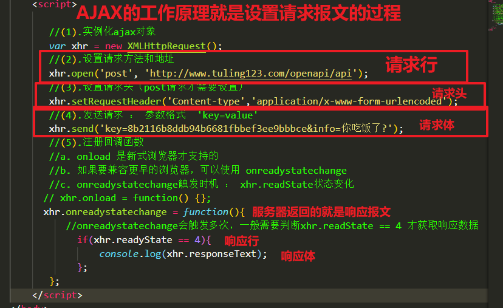
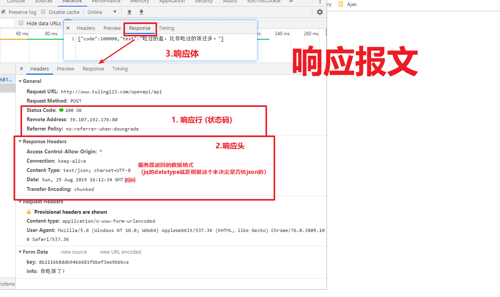
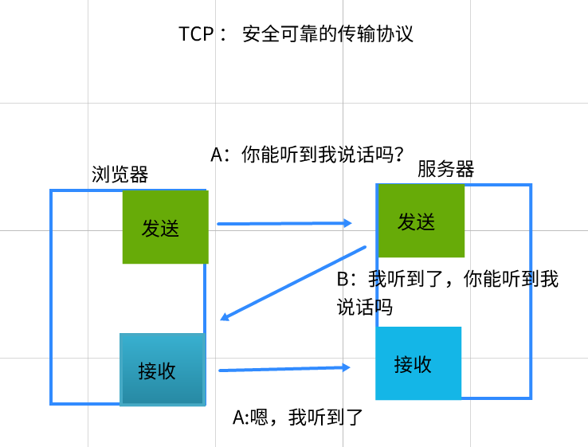
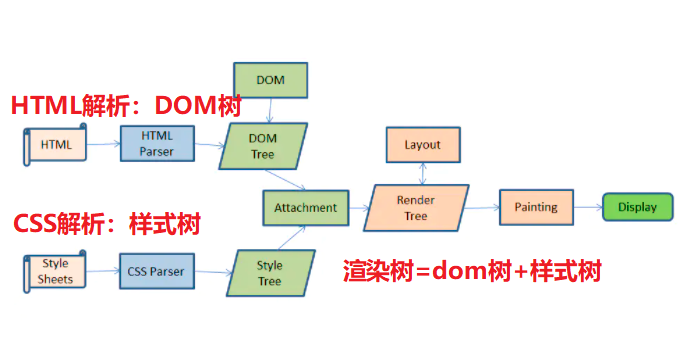
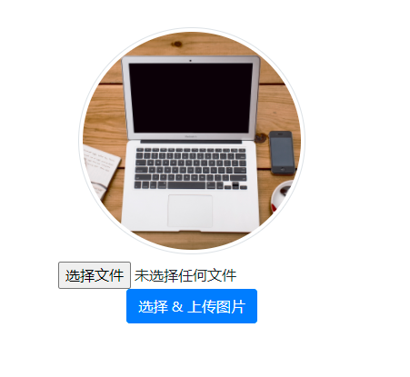
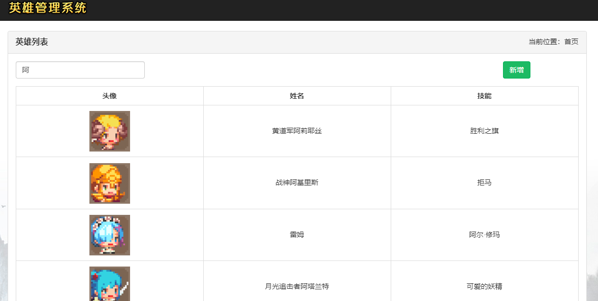
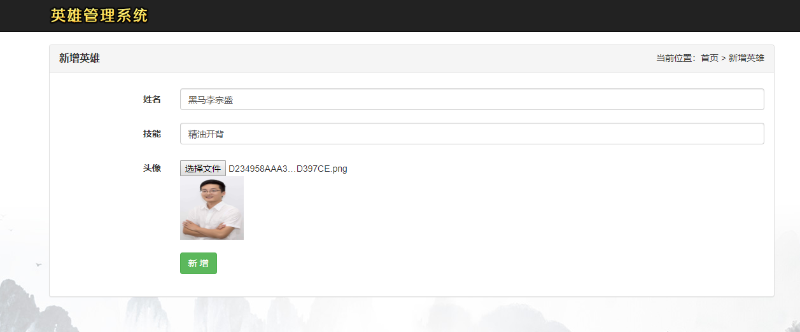
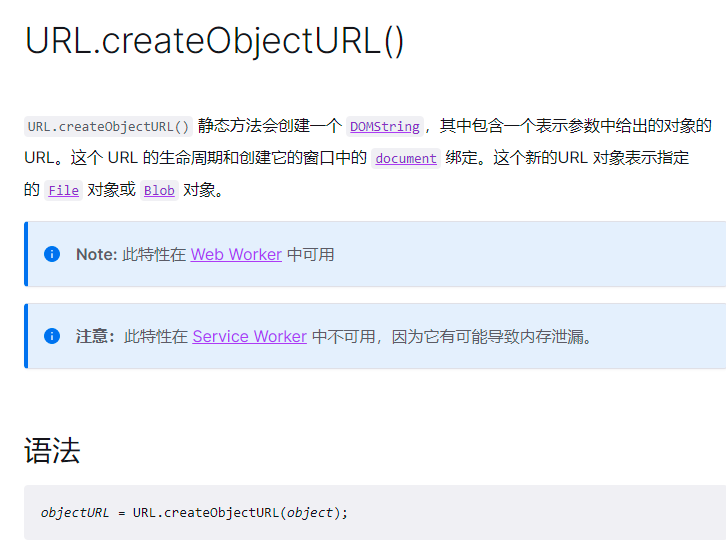
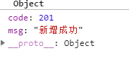

# 01-Ajax工作原理(面试用)


## 1.1-HTTP协议原理与ajax工作原理


* 课后学习传送门（一个网站从输入网址到呈现页面完整流程）

  * <https://www.jianshu.com/p/c93d47c26a81>
* 课后学习传送门： 查看各种响应状态码含义
  * https://developer.mozilla.org/zh-CN/docs/Web/HTTP/Status/100


* 1.什么HTTP协议

  * 协议指的是规定浏览器跟服务器交互的数据格式

* 2.浏览器请求 必须是：`请求报文`

* 3.服务器响应 必须是：`响应报文`

* 4.请求报文与响应报文的数据格式如下

  * a.请求报文

    * (1)请求行 ： 包含请求方法, URL, 协议版本
    * (2)请求头：包含请求的附加信息, 由关键字/值对组成
    * (3)请求体：浏览器发送给服务器的数据(`参数`)

  * b.响应报文

    * (1)响应行：包含协议版本, 状态码, 状态码描述
      * 1xx, 指示信息, 表示请求已接收, 继续处理
      * `2xx, 成功, 表示请求已被成功接收和处理.`
      * 3xx, 重定向, 表示要完成请求必须进行更进一步操作
      * `4xx, 客户端错误, 表示有语法错误或请求无法实现`
      * `5xx, 服务器端错误, 表示服务器未能实现合法的请求`
    * (2)响应头:content-type 返回的数据格式，jQuery自动转JSON就是根据他来判断的
    * (3)响应体：服务器响应给浏览器的数据 （`xhr.responseText`）

    

    



```html
<!DOCTYPE html>
<html lang="en">
  <head>
    <meta charset="UTF-8" />
    <meta name="viewport" content="width=device-width, initial-scale=1.0" />
    <meta http-equiv="X-UA-Compatible" content="ie=edge" />
    <title>Document</title>
  </head>
  <body>
    <script>
      /* 
        1.HTTP : 网络传输协议
            * 协议 ： 约定 数据传输格式
        2.HTTP协议组成部分
            2.1 请求报文
            2.2 响应报文
        3. 请求报文三个组成部分
            3.1 请求行 ： 包含请求方法, URL, 协议版本
            3.2 请求头 ： 浏览器告诉服务器，我给的数据是什么格式 （content-type在请求头中）
            3.3 请求体 ： post请求参数在请求体中
        4. 响应报文三个组成部分
            4.1 响应行 ： 包含协议版本, 状态码, 状态码描述
                2开头 ： 请求成功  200
                3开头 ： 重定向  302  
                4开头 ： 前端问题  400参数错误   401 没有权限  404 url错误
                5开头 ： 后台问题  500 服务器bug,可以理解为后台java代码爆红
            4.2 响应头 ： 浏览器告诉服务器，我给你的数据是什么格式 （浏览器会自动识别）
            4.3 响应体 ： 后台响应的数据，一般是json格式
        5.ajax原理： 设置http请求报文的过程
         */

      //(1).实例化ajax对象
      let xhr = new XMLHttpRequest()
      //(2).设置请求方法和地址
      xhr.open("post", "http://www.liulongbin.top:3009/api/login")
      //(3).设置请求头（post请求才需要设置）
      xhr.setRequestHeader("Content-type", "application/x-www-form-urlencoded")
      //(4).发送请求 ： 参数格式  'key=value'
      xhr.send("username=admin&password=123456")
      //(5).注册回调函数
      // xhr.onload = function() {};
      xhr.onreadystatechange = function() {
        //onreadystatechange会触发多次，一般需要判断xhr.readState == 4 才获取响应数据
        if (xhr.readyState == 4) {
          console.log(xhr.responseText)
        }
      }
    </script>
  </body>
</html>

```


## 1.2-一个页面从输入url到呈现过程


* 相关知识点参考：https://www.jianshu.com/p/c93d47c26a81





* 1.DNS域名解析： 将url中的域名解析成ip地址

* 2.TCP三次握手： 建立安全的网络传输协议

  * 2.1 什么是TCP : 一种 传输控制协议

  * 2.2 TCP作用 :  保证HTTP网络传输是 安全 + 可靠的 （检测客户端 与 服务器的网卡是不是通的）

  * 2.3 TCP三次握手 : 

    ​                第一次:  浏览器  -> 服务器   (你能听到我说话吗?,检测浏览器:发送)

    ​                第二次:  服务器  -> 浏览器   (我听到了,你能听到我说话吗。 检测浏服务器: 接收 + 发送)

    ​                第三次:  浏览器 -> 服务器    (嗯,我听到了. 检测浏览器: 接收)

* 3.HTTP建立连接 
  * 3.1 客户端发送请求
  * 3.2 服务器处理请求
  * 3.3 服务器响应请求
  
* 4.渲染引擎开始渲染响应返回的HTML文本

  * 4.1 解析html生成：dom树
  * 4.2 解析css生成：样式树
  * 4.3 dom树 与 样式树 合并得到 渲染树
  * 4.4 呈现页面


# 02-文件上传





* FormData对象官方文档：https://developer.mozilla.org/zh-CN/docs/Web/API/FormData

* 文件上传必须要FormData对象 ： 因为文件数据 和 文本数据 在传输的时候，数据格式不同。需要formdata对象进行自动处理。

  

## 1.1-文件上传思路

```html
<!DOCTYPE html>
<html lang="en">
  <head>
    <meta charset="UTF-8" />
    <meta http-equiv="X-UA-Compatible" content="IE=edge" />
    <meta name="viewport" content="width=device-width, initial-scale=1.0" />
    <title>案例-头像上传</title>
    <link rel="stylesheet" href="./lib/bootstrap-v4.6.0.css" />
    <style>
      .thumb-box {
        text-align: center;
        margin-top: 50px;
      }

      .thumb {
        width: 250px;
        height: 250px;
        object-fit: cover;
        border-radius: 50%;
      }
    </style>
  </head>

  <body>
    <div class="thumb-box">
      <!-- 头像 -->
      
      <div class="mt-2">
        <!-- 文件选择框 -->
        <!-- accept 属性表示可选择的文件类型 -->
        <!-- image/* 表示只允许选择图片类型的文件 -->
        <input type="file" id="iptFile" accept="image/*" />
        <br />
        <!-- 选择头像图片的按钮 -->
        <button class="btn btn-primary" id="btnChoose">选择 & 上传图片</button>
      </div>
    </div>

    <script src="./lib/axios.js"></script>
    <script>
      /*文件上传思路总结 
      1. 给file表单注册onchange事件 
        * 当用户选择图片之后执行
      2. 获取用户选择的图片 
        * this.files[0]
      3. 创建FormData对象 
        * 只有FormData才可以上传文件
      4. 将图片添加到FormData对象中 
        * fd.append('参数名', this.files[0])
      5. 发送ajax请求
        * 文件上传请求方法一定是post, 且请求参数为 FormData对象
      */
     
      //1. file类型表单自带一个选择文件点击按钮，当用户选择文件之后就会触发onchange事件
      document.querySelector("#iptFile").onchange = function() {
        //this : file表单
        //(1)获取用户选择的文件
        let file = this.files[0]
        // 非空判断，如果内容为undefined，给出提示
        if (file == undefined) {
          return alert("请选择上传文件！")
        }
        //(2)创建FormData对象， 只有FormData对象才可以上传文件
        let fd = new FormData()
        //(3)添加文件
        fd.append("avatar", file)
        //(4)发送ajax请求, 参数为 FormData对象
        axios({
          method: "POST",
          url: "http://www.liulongbin.top:3009/api/upload/avatar",
          data: fd
        }).then(({ data: res }) => {
          console.log(res)
          if (res.code != 200) {
            return alert(res.message)
          }
          // 成功后提示，修改图片路径
          alert("恭喜您，上传头像成功！")
          document.querySelector("img").src = `http://www.liulongbin.top:3009${res.url}`
        })
      }
    </script>
  </body>
</html>

```


## 1.2-自定义文件上传按钮

* file表单自带的按钮样式太丑，我们可以自定义一个文件上传按钮

```html
<!DOCTYPE html>
<html lang="en">
  <head>
    <meta charset="UTF-8" />
    <meta http-equiv="X-UA-Compatible" content="IE=edge" />
    <meta name="viewport" content="width=device-width, initial-scale=1.0" />
    <title>案例-头像上传</title>
    <link rel="stylesheet" href="./lib/bootstrap-v4.6.0.css" />
    <style>
      .thumb-box {
        text-align: center;
        margin-top: 50px;
      }

      .thumb {
        width: 250px;
        height: 250px;
        object-fit: cover;
        border-radius: 50%;
      }
    </style>
  </head>

  <body>
        <a href="http:www.baidu.com">111</a>
    <div class="thumb-box">
      <!-- 头像 -->
      
      <div class="mt-2">
        <!-- 文件选择框 -->
        <!-- accept 属性表示可选择的文件类型 -->
        <!-- image/* 表示只允许选择图片类型的文件 -->
        <input
          type="file"
          id="iptFile"
          accept="image/*"
          style="display: none"
        />
        <br />
        <!-- 选择头像图片的按钮 -->
        <button class="btn btn-primary" id="btnChoose">
          选择 & 上传图片
        </button>
      </div>
    </div>

    

    <script src="./lib/axios.js"></script>
    <script>
      /*自定义文件上传按钮思路
      (1)隐藏file表单
      (2)给自定义按钮添加一个点击事件
      (3)点击按钮的时候，触发 file表单的点击 
       */

    document.querySelector('#btnChoose').onclick = function(){
        /* 
        dom对象.onclick()  :  只能触发你自己注册的onclick事件，没注册触发不了
        dom对象.click() : 模拟鼠标点击。 触发注册的onclick事件 + 默认点击事件
        */
        document.querySelector('#iptFile').click()
    }


      //1. file类型表单自带一个选择文件点击按钮，当用户选择文件之后就会触发onchange事件
      document.querySelector("#iptFile").onchange = function() {
        //this : file表单
        //(1)获取用户选择的文件
        let file = this.files[0]
        // 非空判断，如果内容为undefined，给出提示
        if (file == undefined) {
          return alert("请选择上传文件！")
        }
        //(2)创建FormData对象， 只有FormData对象才可以上传文件
        let fd = new FormData()
        //(3)添加文件
        fd.append("avatar", file)
        //(4)发送ajax请求, 参数为 FormData对象
        axios({
          method: "POST",
          url: "http://www.liulongbin.top:3009/api/upload/avatar",
          data: fd
        }).then(({ data: res }) => {
          console.log(res)
          if (res.code != 200) {
            return alert(res.message)
          }
          // 成功后提示，修改图片路径
          alert("恭喜您，上传头像成功！")
          document.querySelector(
            "img"
          ).src = `http://www.liulongbin.top:3009${res.url}`
        })
      }
    </script>
  </body>
</html>

```


# 03-案例-英雄管理



## 1.1-项目分析

* 1.需求分析
  * 首页（查询英雄列表）
    * ajax请求数据
    * 输入框搜索事件
  * 增加英雄
    * 选择文件，实现图片预览功能
    * 点击提交，ajax提交表单数据（包含文件提交）
    * 响应成功之后，跳转首页
* 2.技术点分析
  * （1）文件预览
  * （2）文件上传服务器


## 1.1-查询英雄

```html
<!DOCTYPE html>
<html lang="zh-cn">
  <head>
    <meta charset="utf-8" />
    <meta http-equiv="X-UA-Compatible" content="IE=edge" />
    <meta name="viewport" content="width=device-width, initial-scale=1" />
    <!-- 导包 -->
    <script src="./lib/js/jquery-1.12.4.js"></script>
    <script src="./lib/js/bootstrap.js"></script>
    <link rel="stylesheet" href="./lib/css/bootstrap.min.css" />
    <title>首页</title>
    <style>
      .wrap {
        position: fixed;
        left: 0;
        top: 0;
        width: 100%;
        height: 100%;
        background: url("images/bg03.jpg") center bottom no-repeat;
        overflow: auto;
      }

      .navbar-brand {
        padding: 10px 15px;
      }

      .logout {
        font-weight: 900;
        font-size: 20px;
        color: #ff0000;
        text-decoration: none;
      }

      .logout:hover {
        text-decoration: none;
        color: yellowgreen;
      }

      #my-table th {
        text-align: center;
      }

      #my-table td {
        text-align: center;
        line-height: 80px;
        padding: 0;
        padding: 10px;
      }

      td img {
        width: 80px;
        height: 80px;
      }

      .username {
        font-weight: 900;
        color: hotpink;
        background-color: yellowgreen;
      }

      .pagination {
        margin: 0px;
        padding: 0px;
        font-size: 0;
        line-height: 1;
      }

      .pagination li {
        display: inline-block;
        font-size: 14px;
      }

      .mp15 {
        margin-top: 15px;
      }

      .table {
        margin-bottom: 0;
      }

      .table-bordered > thead > tr > td,
      .table-bordered > thead > tr > th {
        border-bottom-width: 1px;
      }

      .page-title {
        font-size: 16px;
        font-weight: bold;
      }
    </style>
  </head>

  <body>
    <div class="wrap">
      <nav class="navbar  navbar-inverse navbar-static-top">
        <div class="container">
          <div class="navbar-header">
            <button
              type="button"
              class="navbar-toggle collapsed"
              data-toggle="collapse"
              data-target="#mymenu"
            >
              <span class="sr-only">Toggle navigation</span>
              <span class="icon-bar"></span>
              <span class="icon-bar"></span>
              <span class="icon-bar"></span>
            </button>
            <a class="navbar-brand" href="#"></a>
          </div>
        </div>
      </nav>

      <div class="container">
        <div class="row">
          <div class="col-md-12">
            <div class="panel panel-default">
              <div class="panel-heading clearfix">
                <div class="row">
                  <div class="col-md-6 page-title">英雄列表</div>
                  <div class="col-md-6 text-right">当前位置：首页</div>
                </div>
              </div>
              <div class="panel-body">
                <div class="row">
                  <div class="col-md-3">
                    <input
                      class="search form-control"
                      type="text"
                      placeholder="请输入英雄名称,enter键搜索"
                    />
                  </div>
                  <div class="col-md-5"></div>
                  <div class="col-md-3">
                    <a href="./add.html" class="btn btn-success pull-right"
                      >新增</a
                    >
                  </div>
                </div>

                <table id="my-table" class="table table-bordered mp15">
                  <thead>
                    <tr>
                      <th width="25%">头像</th>
                      <th width="25%">姓名</th>
                      <th width="25%">技能</th>
                    </tr>
                  </thead>
                  <tbody>
                    <tr>
                      <td></td>
                      <td>盖伦</td>
                      <td>躲草丛</td>
                    </tr>
                  </tbody>
                </table>
              </div>
            </div>
          </div>
        </div>
      </div>
    </div>

    <!-- 导入axios -->
    <script src="./lib/axios.js"></script>
    <script>
      //1.页面一加载，ajax请求英雄列表
      axios({
        url: "https://autumnfish.cn/api/cq/page",
        method: "get",
        params: { pageNum: 1, pageSize: 20 }
      }).then(res => {
        //成功回调
        console.log(res)
        renderData(res.data.list)
      })

      //渲染页面函数封装
      const renderData = arr => {
        document.querySelector("tbody").innerHTML = arr
          .map(item => {
            return `<tr>
                    <td></td>
                    <td>${item.name}</td>
                    <td>${item.skill}</td>
                  </tr>`
          })
          .join("")
      }

      //2.输入框enter按键
      document.querySelector(".search").onkeydown = function(e) {
        //监听enter按键
        if (e.key == "Enter") {
          axios({
            url: "https://autumnfish.cn/api/cq",
            method: "get",
            params: { query:this.value }
          }).then(res => {
            //成功回调
            console.log(res)
            renderData(res.data.list)
          })
        }
      }
    </script>
  </body>
</html>

```


## 1.2-输入框enter事件

```javascript
 //2.输入框enter按键
  document.querySelector(".search").onkeydown = function(e) {
    //监听enter按键
    if (e.key == "Enter") {
      axios({
        url: "https://autumnfish.cn/api/cq",
        method: "get",
        params: { query:this.value }
      }).then(res => {
        //成功回调
        console.log(res)
        renderData(res.data.list)
      })
    }
  }
```


## 1.3-增加英雄(FormData上传文件+文件预览)




* URL.createObjectURL官方文档：https://developer.mozilla.org/zh-CN/docs/Web/API/URL/createObjectURL




* 

```javascript
<!DOCTYPE html>
<html lang="zh-cn">
  <head>
    <meta charset="utf-8" />
    <meta http-equiv="X-UA-Compatible" content="IE=edge" />
    <meta name="viewport" content="width=device-width, initial-scale=1" />
    <title>添加英雄</title>
    <!-- 导包 -->
    <script src="./lib/js/jquery-1.12.4.js"></script>
    <script src="./lib/js/bootstrap.js"></script>
    <link rel="stylesheet" href="./lib/css/bootstrap.min.css" />
    <style>
      .wrap {
        position: fixed;
        left: 0;
        top: 0;
        width: 100%;
        height: 100%;
        background: url("images/bg03.jpg") center bottom no-repeat;
        overflow: auto;
      }

      .navbar-brand {
        padding: 10px 15px;
      }

      .page-title {
        font-size: 16px;
        font-weight: bold;
      }

      .file-input {
        outline: none;
        display: inline-block;
        margin-top: 5px;
      }

      .form-group {
        margin-bottom: 20px;
      }

      .form-horizontal {
        margin-top: 10px;
      }

      .logout {
        font-weight: 900;
        font-size: 20px;
        color: #ff0000;
        text-decoration: none;
      }

      .logout:hover {
        text-decoration: none;
        color: yellowgreen;
      }

      .preview {
        width: 100px;
        height: 100px;
      }
    </style>
  </head>

  <body>
    <div class="wrap">
      <nav class="navbar  navbar-inverse navbar-static-top">
        <div class="container">
          <div class="navbar-header">
            <button
              type="button"
              class="navbar-toggle collapsed"
              data-toggle="collapse"
              data-target="#mymenu"
            >
              <span class="sr-only">Toggle navigation</span>
              <span class="icon-bar"></span>
              <span class="icon-bar"></span>
              <span class="icon-bar"></span>
            </button>
            <a class="navbar-brand" href="#"></a>
          </div>
        </div>
      </nav>

      <div class="container">
        <div class="row">
          <div class="col-md-12">
            <div class="panel panel-default">
              <div class="panel-heading clearfix">
                <div class="row">
                  <div class="col-md-6 page-title">新增英雄</div>
                  <div class="col-md-6 text-right">
                    当前位置：首页 &gt; 新增英雄
                  </div>
                </div>
              </div>
              <div class="panel-body">
                <form action="#" method="" class="form-horizontal">
                  <div class="form-group">
                    <label for="heroName" class="col-sm-2 control-label"
                      >姓名</label
                    >
                    <div class="col-sm-10">
                      <input
                        type="text"
                        class="form-control"
                        id="heroName"
                        name="name"
                        placeholder="请输入姓名"
                      />
                    </div>
                  </div>
                  <div class="form-group">
                    <label for="skillName" class="col-sm-2 control-label"
                      >技能</label
                    >
                    <div class="col-sm-10">
                      <input
                        type="text"
                        class="form-control"
                        id="heroSkill"
                        name="skill"
                        placeholder="请输入技能"
                      />
                    </div>
                  </div>
                  <div class="form-group">
                    <label for="heroIcon" class="col-sm-2 control-label"
                      >头像</label
                    >
                    <div class="col-sm-10">
                      <!-- img仅仅是用来显示图片的,真正用来选择头像文件的还是input标签 -->
                      <input
                        type="file"
                        class="file-input"
                        id="heroIcon"
                        name="icon"
                      />
                      
                    </div>
                  </div>
                  <div class="form-group">
                    <div class="col-sm-offset-2 col-sm-10">
                      <button type="submit" class="btn btn-success btn-add">
                        新 增
                      </button>
                    </div>
                  </div>
                </form>
              </div>
            </div>
          </div>
        </div>
      </div>
    </div>

    <!-- 导入axios -->
    <script src="./lib/axios.js"></script>

    <script>
      // 入口函数
      /* 1.文件预览功能步骤
      1.1 给file表单设置 onchange事件
      1.2 获取选取的文件 ： this.files[0]
      1.3 创建临时url ： URL.createObjectURL()
      1.4 显示到页面
       */
      //1.1 给file表单设置 onchange事件
      document.querySelector("#heroIcon").onchange = function() {
        //1.2 获取选取的文件信息 ： this.files[0]
        let fileIcon = this.files[0]
        //1.3 创建临时url ： URL.createObjectURL()
        let url = URL.createObjectURL(fileIcon)
        //1.4 显示到页面
        document.querySelector(".preview").src = url
      }

      //1.2 点击新增按钮
      document.querySelector('.btn-add').onclick = function(e){
        //0.表单按钮需要阻止默认跳转
        e.preventDefault()
        //1.创建formdata对象
        let fd = new FormData()
        //2.追加参数
        fd.append('heroName', document.querySelector('#heroName').value )
        fd.append('heroSkill', document.querySelector('#heroSkill').value )
        fd.append('heroIcon', document.querySelector('#heroIcon').files[0] )
        //3.发送请求
        axios({
          url:'https://autumnfish.cn/api/cq/add',
          method:'post',
          data: fd,
        }).then(res=>{
          //成功回调
          console.log(res)
          if( res.data.code != 201 ){
            return alert(res.data.msg)
          }

          alert('新增成功')
          //跳转首页
          location.href = './index.html'
        })
      }
    </script>
  </body>
</html>

```

* 完整代码

```html
<!DOCTYPE html>
<html lang="zh-cn">

<head>
  <meta charset="utf-8" />
  <meta http-equiv="X-UA-Compatible" content="IE=edge" />
  <meta name="viewport" content="width=device-width, initial-scale=1" />
  <title>添加英雄</title>
  <!-- 导包 -->
  <script src="./lib/js/jquery-1.12.4.js"></script>
  <script src="./lib/js/bootstrap.js"></script>
  <link rel="stylesheet" href="./lib/css/bootstrap.min.css">
  <script src="./lib/js/template-web.js"></script>
  <style>
    .wrap {
      position: fixed;
      left: 0;
      top: 0;
      width: 100%;
      height: 100%;
      background: url('images/bg03.jpg') center bottom no-repeat;
      overflow: auto;
    }

    .navbar-brand {
      padding: 10px 15px;
    }

    .page-title {
      font-size: 16px;
      font-weight: bold;
    }

    .file-input {
      outline: none;
      display: inline-block;
      margin-top: 5px;
    }

    .form-group {
      margin-bottom: 20px;
    }

    .form-horizontal {
      margin-top: 10px;
    }

    .logout {
      font-weight: 900;
      font-size: 20px;
      color: #ff0000;
      text-decoration: none;
    }

    .logout:hover {
      text-decoration: none;
      color: yellowgreen;
    }

    .preview {
      width: 100px;
      height: 100px;
    }
  </style>
</head>

<body>
  <div class="wrap">
    <nav class="navbar  navbar-inverse navbar-static-top">
      <div class="container">
        <div class="navbar-header">
          <button type="button" class="navbar-toggle collapsed" data-toggle="collapse" data-target="#mymenu">
            <span class="sr-only">Toggle navigation</span>
            <span class="icon-bar"></span>
            <span class="icon-bar"></span>
            <span class="icon-bar"></span>
          </button>
          <a class="navbar-brand" href="#"></a>
        </div>
      </div>
    </nav>

    <div class="container">
      <div class="row">
        <div class="col-md-12">
          <div class="panel panel-default">
            <div class="panel-heading clearfix">
              <div class="row">
                <div class="col-md-6 page-title">新增英雄</div>
                <div class="col-md-6 text-right">当前位置：首页 &gt; 新增英雄</div>
              </div>
            </div>
            <div class="panel-body">
              <form action="#" method="" class="form-horizontal">
                <div class="form-group">
                  <label for="heroName" class="col-sm-2 control-label">姓名</label>
                  <div class="col-sm-10">
                    <input type="text" class="form-control" id="heroName" name="name" placeholder="请输入姓名" />
                  </div>
                </div>
                <div class="form-group">
                  <label for="skillName" class="col-sm-2 control-label">技能</label>
                  <div class="col-sm-10">
                    <input type="text" class="form-control" id="skillName" name="skill" placeholder="请输入技能" />
                  </div>
                </div>
                <div class="form-group">
                  <label for="heroIcon" class="col-sm-2 control-label">头像</label>
                  <div class="col-sm-10">
                    <!-- img仅仅是用来显示图片的,真正用来选择头像文件的还是input标签 -->
                    <input type="file" class="file-input" id="heroIcon" name="icon" />
                    
                  </div>
                </div>
                <div class="form-group">
                  <div class="col-sm-offset-2 col-sm-10">
                    <button type="submit" class="btn btn-success btn-add">
                      新 增
                    </button>
                  </div>
                </div>
              </form>
            </div>
          </div>
        </div>
      </div>
    </div>
  </div>
  <script>
    // 入口函数
    $(function () {
      /* 1.文件预览功能步骤
      1.1 给file表单设置 onchange事件
      1.2 获取选取的文件 ： this.files[0]
      1.3 创建临时url ： URL.createObjectURL()
      1.4 显示到页面
       */
      //1.1 给file表单设置 onchange事件
      $('#heroIcon').on('change', function () {
        //1.2 获取选取的文件信息 ： this.files[0]
        let fileIcon = this.files[0];
        //1.3 创建临时url ： URL.createObjectURL()
        let url = URL.createObjectURL(fileIcon);
        //1.4 显示到页面
        $(this).next().attr('src', url);
      });

      /*2.添加英雄 （FormData上传文件） 
      //2.1 阻止表单默认提交事件 ： e.preventDefault();
      //2.2 创建FormData对象 ： new FormData(表单form)
      //2.3 ajax发送post请求
      //2.4 成功之后跳转回首页
      */
      $('form').on('submit', function (e) {
        //2.1 阻止表单默认提交事件 ： e.preventDefault();
        e.preventDefault();
        //2.2 创建FormData对象 ： new FormData(表单form)
        let fd = new FormData(this);
        //2.3 ajax发送post请求
        $.ajax({
          type: 'post',
          url: 'http://127.0.0.1:4399/hero/add',
          data: fd,
           /* jquery独有属性，会自动对表单数据序列化。文件上传不需要 */
          processData: false, 
          /*默认情况下jquery设置请求头的数据类型是application/x-www-form-urlencoded; charset=UTF-8，
          而文件上传的数据类型是表单默认的multipart/form-data*/
          contentType: false,
          success: function (data) {
            //console.log(data);
            if (data.code == 201) {
              //2.4 成功之后跳转回首页
              alert('新增成功!');
              window.location.href = './index.html';
            }
          }
        });
      });
    });
  </script>
</body>

</html>
```


## 1.4-案例总结


* 1.文件预览功能思路(`这是一个固定流程的功能`)
  * 1.1 给file表单设置 onchange事件
  * 1.2 获取选取的文件 ： this.files[0]
  * 1.3 创建临时url ： URL.createObjectURL()
  * 1.4 显示到页面
* 2.文件上传功能思路
  * 2.1 阻止表单默认提交事件 ： e.preventDefault();
  * 2.2`创建FormData对象 ： new FormData(表单form)`
  * 2.3 `ajax发送post请求`
  * 2.4 成功之后跳转回首页


# 04-函数防抖与节流(面试+应用)


## 1.1-函数防抖


* 函数防抖：单位时间内，频繁触发事件，只会触发最后一次

* 函数防抖实际开发应用场景： 实时获取输入框文本


```html
<!DOCTYPE html>
<html lang="en">
<head>
    <meta charset="UTF-8">
    <meta name="viewport" content="width=device-width, initial-scale=1.0">
    <meta http-equiv="X-UA-Compatible" content="ie=edge">
    <title>Document</title>
</head>
<body>
    <input type="text" placeholder="请输入文本">

    <script>
        /* 
        1.函数防抖 :  单位时间内，频繁触发事件，只会触发最后一次
        2.经典应用场景 ： 输入框输入事件
        3.函数防抖流程 ：
            3.1 声明全局变量存储定时器ID
            3.2 每一次触发事件, 先清除上一次定时器。 然后将事件处理代码放入本次定时器中
        */

        let timeID = null
        document.querySelector('input').oninput = function(){
            
            //清除上一次定时器
            clearTimeout(timeID)
            //开启本次定时器. 500ms内用户没有触发，自动执行定时器代码。 
            timeID = setTimeout(()=>{
                console.log(`发送ajax请求，搜索内容为${this.value}`)
            },500)            
        }
    </script>
</body>
</html>
```


## 1.2-函数节流

* 函数节流：单位时间内，频繁触发事件，只会触发一次
* 函数节流应用场景 ： 解决高频事件，频繁触发事件浪费性能


```html
<!DOCTYPE html>
<html lang="en">
<head>
    <meta charset="UTF-8">
    <meta name="viewport" content="width=device-width, initial-scale=1.0">
    <meta http-equiv="X-UA-Compatible" content="ie=edge">
    <title>Document</title>
    <style>
        body{
            width: 3000px;
            height: 3000px;
        }        
    </style>
</head>
<body>
    

    <script>
        /* 
        1.函数防抖 :  单位时间内，频繁触发事件，只会触发一次
        2.经典应用场景 ： 滚动条事件
        3.函数防抖流程 ：
            3.1 声明全局变量存储上一次触发交互时间
            3.2 每一次触发事件, 获取当前时间  与 上一次时间做比较。判断是否超过节流间隔
            3.3 如果 超过节流时间，则执行事件处理代码。 并且存储本次触发时间。
        */

        let lastTime = null
        window.onscroll = function(){
            //判断时间间隔
            let currentTime = Date.now()
            if( currentTime - lastTime >= 500 ){
                console.log('执行滚动条事件处理代码')
                //存储本次触发时间
                lastTime = currentTime
            }
        }
    </script>
</body>
</html>
```


# 今日接口文档

### 1.文件上传

* 请求地址：http://www.liulongbin.top:3009/api/upload/avatar
* 请求方法：post
* 请求参数：avatar

| 参数名 | 参数说明 | 备注       |
| ------ | -------- | ---------- |
| avatar | 用户头像 | `图片文件` |

### 2.英雄列表

* 请求地址：https://autumnfish.cn/api/cq/page
* 请求方法：get
* 请求参数：

| 参数名   | 参数说明 | 备注     |
| -------- | -------- | -------- |
| pageNum  | 页数     | 必须要传 |
| pageSize | 每页数量 | 必须要传 |

### 3.英雄搜索

* 请求地址：https://autumnfish.cn/api/cq
* 请求方法：get
* 请求参数：query  不传则默认返回所有英雄

| 参数名 | 参数说明     | 备注                       |
| ------ | ------------ | -------------------------- |
| query  | 英雄名称搜索 | 可以不传，不传返回所有英雄 |

### 4.英雄新增

* 请求地址：https://autumnfish.cn/api/cq/add
* 请求方法：post
* 请求参数：

| 参数名    | 参数说明 | 备注           |
| --------- | -------- | -------------- |
| heroName  | 英雄名称 | 必传，文本类型 |
| heroSkill | 英雄技能 | 必传，文本类型 |
| heroIcon  | 英雄头像 | 必传，图片文件 |

