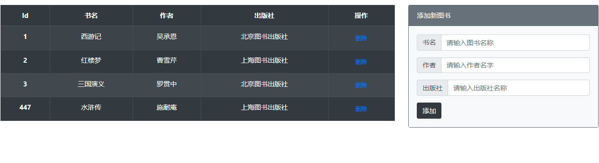
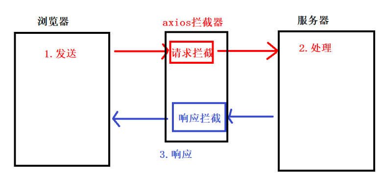
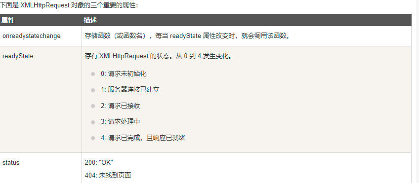
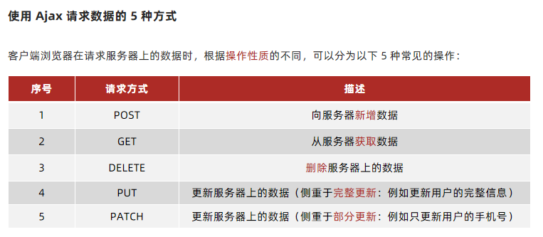

# 01-综合案例：图书管理




>
>
>/*思路分析 
>
>​      1.页面一加载,ajax请求所有图书列表
>
>​        \* 技术点：数据驱动渲染页面
>
>​      2.点击添加按钮 ： 添加图书
>
>​        \* 技术点: 获取表单里面的参数
>
>​      3.点击删除按钮 ： 删除图书
>
>​        \* 技术点: 动态新增按钮无法直接注册事件,需要使用 事件委托
>
>​      4.页面所有的ajax请求都需要loading效果
>
>​        \* 技术点: axios拦截器使用
>
>​      */

## 1.1-查询图书列表

```javascript
//函数(1) : 封装请求所有图书列表的函数
  function renderBookList() {
    axios
      .get("http://www.liulongbin.top:3006/api/getbooks")
      .then(({ data: res }) => {
        document.querySelector("tbody").innerHTML = res.data
          .map(item => {
            return `<tr>
                            <th scope="row">${item.id}</th>
                            <td>${item.bookname}</td>
                            <td>${item.author}</td>
                            <td>${item.publisher}</td>
                            <td>
                                <button type="button" class="btn btn-link btn-sm">删除</button>
                            </td>
                        </tr>`
          })
          .join("")
      })
  }

 // 1.页面加载后，要初始化图书列表; 函数不调用不执行;
renderBookList()
```


## 1.2-封装函数获取表单参数

```javascript
//函数(2) : 封装获取表单参数的函数
  function getFormData() {
      /* 表单name属性作用: 告诉服务器,这个表单的数据是什么
         开发中，表单的name属性一般会根据接口文档来设置。
         接口文档参数是什么,表单name就写什么
      */
    let inputList = document.querySelectorAll("#addForm input")
    //声明空对象
    let obj = {}
    //遍历数组
    inputList.forEach(item => {
      // 表单name : 接口参数名   表单value : 接口参数值
      obj[item.name] = item.value
    })
    //返回对象
    return obj
  }


```


## 1.3-新增图书

```javascript
//2. 添加按钮点击
  document.querySelector("#addForm").onsubmit = function(e) {
    // (1)阻止表单提交
    e.preventDefault()
    // (2)获取表单的参数
    let data = getFormData()
    // (3)非空判断
    if (Object.values(data).some(item => item == "")) {
      alert("输入框不能为空")
      return
    }
    // (4)发送ajax
    axios({
      url: "http://www.liulongbin.top:3006/api/addbook",
      method: "post",
      data
    }).then(res => {
      //成功回调  201 : 成功   其他状态码 : 失败
      if (res.data.status != 201) {
        return alert(res.data.msg)
      }
      // 成功提示
      alert(res.data.msg)
      // 重新初始化图书列表
      renderBookList()
      // 重置form表单
      document.querySelector("#addForm").reset()
    })
  }
```


## 1.4-删除图书

```javascript
//3.使用事件委托给删除按钮注册事件
  /* 事件委托： 给父元素注册事件，委托子元素处理 */
  document.querySelector(".table>tbody").onclick = function(e) {
    //判断是否是委托的子元素
    //删除按钮需要增加两个属性 (1)类名用于判断  (2)自定义属性存储id
    if (e.target.classList.contains("delete")) {
      let id = e.target.getAttribute("data-id")
      axios({
        url: "http://www.liulongbin.top:3006/api/delbook",
        method: "get",
        params: { id }
      }).then(res => {
        //成功回调
        if (res.data.status != 200) {
          // 失败提示
          return alert(res.data.msg)
        }
        // 成功提示
        alert(res.data.msg)
        // 重新渲染图书列表
        renderBookList()
      })
    }
  }
```


## 1.5-loading效果实现

```html
<!DOCTYPE html>
<html lang="en">
  <head>
    <meta charset="UTF-8" />
    <meta http-equiv="X-UA-Compatible" content="IE=edge" />
    <meta name="viewport" content="width=device-width, initial-scale=1.0" />
    <title>Document</title>
    <!-- 引入 lib 目录下的 bootstrap 样式表 -->
    <link rel="stylesheet" href="./lib/bootstrap-v4.6.0.css" />
    <style>
      :root {
        font-size: 15px;
      }

      body {
        padding-top: 15px;
      }

      .loading-box {
        position: fixed;
        top: 30%;
        left: 50%;
        transform: translateX(-50%);
        background-color: rgba(0, 0, 0, 0.1);
        border-radius: 10px;
        box-shadow: 1px 1px 3px #efefef;
        display: none;
      }
    </style>
  </head>

  <body>
    <!-- 栅格系统 -->
    <div class="container-fluid">
      <!-- 栅格系统中的一行 -->
      <div class="row">
        <!-- 左侧的表格，占了 8 列 -->
        <div class="col-sm-8">
          <table
            class="table table-bordered table-striped table-dark table-hover text-center"
          >
            <thead>
              <!-- 表头行 -->
              <tr>
                <th scope="col">Id</th>
                <th scope="col">书名</th>
                <th scope="col">作者</th>
                <th scope="col">出版社</th>
                <th scope="col">操作</th>
              </tr>
            </thead>
            <tbody>
              <!-- 表格中的每一行 -->
              <tr>
                <th scope="row">xxx</th>
                <td>xxx</td>
                <td>xxx</td>
                <td>xxx</td>
                <td>
                  <button type="button" class="btn btn-link btn-sm">
                    删除
                  </button>
                </td>
              </tr>
            </tbody>
          </table>
        </div>

        <!-- 右侧的添加区域，占了 4 列 -->
        <div class="col-sm-4">
          <!-- 添加图书的卡片 -->
          <div class="card text-white bg-secondary sticky-top">
            <div class="card-header">添加新图书</div>
            <form class="card-body bg-light" id="addForm">
              <!-- 书名 -->
              <div class="input-group mb-3">
                <div class="input-group-prepend">
                  <span class="input-group-text">书名</span>
                </div>
                <input
                  type="text"
                  class="form-control"
                  placeholder="请输入图书名称"
                  name="bookname"
                />
              </div>
              <!-- 作者 -->
              <div class="input-group mb-3">
                <div class="input-group-prepend">
                  <span class="input-group-text">作者</span>
                </div>
                <input
                  type="text"
                  class="form-control"
                  placeholder="请输入作者名字"
                  name="author"
                />
              </div>
              <!-- 出版社 -->
              <div class="input-group mb-3">
                <div class="input-group-prepend">
                  <span class="input-group-text">出版社</span>
                </div>
                <input
                  type="text"
                  class="form-control"
                  placeholder="请输入出版社名称"
                  name="publisher"
                />
              </div>
              <!-- 添加按钮 -->
              <button class="btn btn-dark" type="submit">添加</button>
            </form>
          </div>
        </div>
      </div>
    </div>

    <!-- loading 区域 -->
    <div class="loading-box">
      <div class="spinner-border m-5 text-primary" role="status">
        <span class="sr-only">Loading...</span>
      </div>
    </div>

    <!-- 导入axios -->
    <script src="./lib/axios.js"></script>

    <script>
      /*思路分析 
	    1.页面一加载,ajax请求所有图书列表
            * 技术点：数据驱动渲染页面
	    2.点击添加按钮 ： 添加图书
            * 技术点: 获取表单里面的参数
	    3.点击删除按钮 ： 删除图书
            * 技术点: 动态新增按钮无法直接注册事件,需要使用 事件委托
	    4.页面所有的ajax请求都需要loading效果
            * 技术点: axios拦截器使用
	    */

      //函数(1) : 封装请求所有图书列表的函数
      function renderBookList() {
        //显示loading : ajax发送之前
        document.querySelector(".loading-box").style.display = "block"
        axios
          .get("http://www.liulongbin.top:3006/api/getbooks")
          .then(({ data: res }) => {
            console.log(res)
            //隐藏loading : 服务器响应之后
            document.querySelector(".loading-box").style.display = "none"
            document.querySelector("tbody").innerHTML = res.data
              .map(item => {
                return `<tr>
                <th scope="row">${item.id}</th>
                <td>${item.bookname}</td>
                <td>${item.author}</td>
                <td>${item.publisher}</td>
                <td>
                    <button type="button" data-id="${item.id}" class="btn delete btn-link btn-sm">删除</button>
                </td>
                </tr>`
              })
              .join("")
          })
      }

      //函数(2) : 封装获取表单参数的函数
      function getFormData() {
        /* 表单name属性作用: 告诉服务器,这个表单的数据是什么
             开发中，表单的name属性一般会根据接口文档来设置。
             接口文档参数是什么,表单name就写什么
          */
        let inputList = document.querySelectorAll("#addForm input")
        //声明空对象
        let obj = {}
        //遍历数组
        inputList.forEach(item => {
          // 表单name : 接口参数名   表单value : 接口参数值
          obj[item.name] = item.value
        })
        //返回对象
        return obj
      }

      // 1.页面加载后，要初始化图书列表; 函数不调用不执行;
      renderBookList()
      //2. 添加按钮点击
      document.querySelector("#addForm").onsubmit = function(e) {
        // (1)阻止表单提交
        e.preventDefault()
        // (2)获取表单的参数
        let data = getFormData()
        // (3)非空判断
        if (Object.values(data).some(item => item == "")) {
          alert("输入框不能为空")
          return
        }

        //显示loading : ajax发送之前
        document.querySelector(".loading-box").style.display = "block"

        // (4)发送ajax
        axios({
          url: "http://www.liulongbin.top:3006/api/addbook",
          method: "post",
          data
        }).then(res => {
          //隐藏loading : 服务器响应之后
          document.querySelector(".loading-box").style.display = "none"
          //成功回调  201 : 成功   其他状态码 : 失败
          if (res.data.status != 201) {
            return alert(res.data.msg)
          }
          // 成功提示
          alert(res.data.msg)
          // 重新初始化图书列表
          renderBookList()
          // 重置form表单
          document.querySelector("#addForm").reset()
        })
      }

      //3.使用事件委托给删除按钮注册事件
      /* 事件委托： 给父元素注册事件，委托子元素处理 */
      document.querySelector(".table>tbody").onclick = function(e) {
        //判断是否是委托的子元素
        //删除按钮需要增加两个属性 (1)类名用于判断  (2)自定义属性存储id
        if (e.target.classList.contains("delete")) {
          let id = e.target.getAttribute("data-id")
          //显示loading : ajax发送之前
          document.querySelector(".loading-box").style.display = "block"
          axios({
            url: "http://www.liulongbin.top:3006/api/delbook",
            method: "get",
            params: { id }
          }).then(res => {
            //隐藏loading : 服务器响应之后
            document.querySelector(".loading-box").style.display = "none"
            //成功回调
            if (res.data.status != 200) {
              // 失败提示
              return alert(res.data.msg)
            }
            // 成功提示
            alert(res.data.msg)
            // 重新渲染图书列表
            renderBookList()
          })
        }
      }
    </script>
  </body>
</html>

```


## ==1.6-axios拦截器使用==




```html
<!DOCTYPE html>
<html lang="en">
  <head>
    <meta charset="UTF-8" />
    <meta http-equiv="X-UA-Compatible" content="IE=edge" />
    <meta name="viewport" content="width=device-width, initial-scale=1.0" />
    <title>Document</title>
    <link rel="stylesheet" href="./lib/bootstrap-v4.6.0.css" />
    <style>
      body {
        padding: 20px;
      }

      .loading-box {
        position: fixed;
        top: 30%;
        left: 50%;
        transform: translateX(-50%);
        background-color: rgba(0, 0, 0, 0.1);
        border-radius: 10px;
        box-shadow: 1px 1px 3px #efefef;
        display: none;
      }
    </style>
  </head>

  <body>
    <!-- 按钮 -->
    <button class="btn btn-primary" id="btn1">请求1</button>
    <button class="btn btn-info" id="btn2">请求2</button>
    <button class="btn btn-warning" id="btn3">请求3</button>

    <!-- loading 区域 -->
    <div class="loading-box">
      <div class="spinner-border m-5 text-primary" role="status">
        <span class="sr-only">Loading...</span>
      </div>
    </div>

    <script src="./lib/axios.js"></script>

    <script>
      /* axios拦截器工作流程
     1. axios 发起请求
     2. 执行 请求拦截器 : 添加ajax发送请求之前的操作
     3. 服务器 接收、处理、响应 请求
     4. 执行 响应拦截器 ： 添加服务器响应之后的操作
     4. axios 接收响应(执行then方法)
     */

      // 添加请求拦截器
      axios.interceptors.request.use(
        function(config) {
          // 可以操作这次请求了
          // console.log(config); // ajax请求参数;
          // 展示 loading 效果
          document.querySelector(".loading-box").style.display = "block"
          // 返回固定数据
          return config
        },
        function(error) {
          // 对请求错误做些什么 , 下面这句话，固定语法;
          return Promise.reject(error)
        }
      )

      // 添加响应拦截器
      axios.interceptors.response.use(
        function(response) {
          //服务器响应的数据
          // console.log(response);
          // 隐藏 loading 效果
          document.querySelector(".loading-box").style.display = "none"
          // 把服务器响应的数据返回给axios的then方法
          return response
        },
        function(error) {
          // 隐藏 loading 效果
          $(".loading-box").hide() // 失败了，也要隐藏 loadding 效果;
          // 对响应错误做点什么
          return Promise.reject(error)
        }
      )

      //按钮1
      document.querySelector("#btn1").onclick = function() {
        axios({
          url: "http://www.liulongbin.top:3009/api/news",
          method: "get"
        }).then(res => {
          //成功回调
          console.log(res)
        })
      }

      //按钮2
      document.querySelector("#btn2").onclick = function() {
        axios({
          url: "https://autumnfish.cn/fruitApi/fruits",
          method: "get"
        }).then(res => {
          //成功回调
          console.log(res)
        })
      }
      //按钮3
      document.querySelector("#btn3").onclick = function() {
        axios({
          url: "http://www.liulongbin.top:3009/api/login",
          method: "post",
          data:{ username:'admin',password:'123456'}
        }).then(res => {
          //成功回调
          console.log(res)
        })
      }
    </script>
  </body>
</html>

```


## 1.7-axios基地址

```html
<!DOCTYPE html>
<html lang="en">
  <head>
    <meta charset="UTF-8" />
    <meta http-equiv="X-UA-Compatible" content="IE=edge" />
    <meta name="viewport" content="width=device-width, initial-scale=1.0" />
    <title>Document</title>
    <!-- 引入 lib 目录下的 bootstrap 样式表 -->
    <link rel="stylesheet" href="./lib/bootstrap-v4.6.0.css" />
    <style>
      :root {
        font-size: 15px;
      }

      body {
        padding-top: 15px;
      }

      .loading-box {
        position: fixed;
        top: 30%;
        left: 50%;
        transform: translateX(-50%);
        background-color: rgba(0, 0, 0, 0.1);
        border-radius: 10px;
        box-shadow: 1px 1px 3px #efefef;
        display: none;
      }
    </style>
  </head>

  <body>
    <!-- 栅格系统 -->
    <div class="container-fluid">
      <!-- 栅格系统中的一行 -->
      <div class="row">
        <!-- 左侧的表格，占了 8 列 -->
        <div class="col-sm-8">
          <table
            class="table table-bordered table-striped table-dark table-hover text-center"
          >
            <thead>
              <!-- 表头行 -->
              <tr>
                <th scope="col">Id</th>
                <th scope="col">书名</th>
                <th scope="col">作者</th>
                <th scope="col">出版社</th>
                <th scope="col">操作</th>
              </tr>
            </thead>
            <tbody>
              <!-- 表格中的每一行 -->
              <tr>
                <th scope="row">xxx</th>
                <td>xxx</td>
                <td>xxx</td>
                <td>xxx</td>
                <td>
                  <button type="button" class="btn btn-link btn-sm">
                    删除
                  </button>
                </td>
              </tr>
            </tbody>
          </table>
        </div>

        <!-- 右侧的添加区域，占了 4 列 -->
        <div class="col-sm-4">
          <!-- 添加图书的卡片 -->
          <div class="card text-white bg-secondary sticky-top">
            <div class="card-header">添加新图书</div>
            <form class="card-body bg-light" id="addForm">
              <!-- 书名 -->
              <div class="input-group mb-3">
                <div class="input-group-prepend">
                  <span class="input-group-text">书名</span>
                </div>
                <input
                  type="text"
                  class="form-control"
                  placeholder="请输入图书名称"
                  name="bookname"
                />
              </div>
              <!-- 作者 -->
              <div class="input-group mb-3">
                <div class="input-group-prepend">
                  <span class="input-group-text">作者</span>
                </div>
                <input
                  type="text"
                  class="form-control"
                  placeholder="请输入作者名字"
                  name="author"
                />
              </div>
              <!-- 出版社 -->
              <div class="input-group mb-3">
                <div class="input-group-prepend">
                  <span class="input-group-text">出版社</span>
                </div>
                <input
                  type="text"
                  class="form-control"
                  placeholder="请输入出版社名称"
                  name="publisher"
                />
              </div>
              <!-- 添加按钮 -->
              <button class="btn btn-dark" type="submit">添加</button>
            </form>
          </div>
        </div>
      </div>
    </div>

    <!-- loading 区域 -->
    <div class="loading-box">
      <div class="spinner-border m-5 text-primary" role="status">
        <span class="sr-only">Loading...</span>
      </div>
    </div>

    <!-- 导入axios -->
    <script src="./lib/axios.js"></script>

    <script>
      /*思路分析 
	    1.页面一加载,ajax请求所有图书列表
            * 技术点：数据驱动渲染页面
	    2.点击添加按钮 ： 添加图书
            * 技术点: 获取表单里面的参数
	    3.点击删除按钮 ： 删除图书
            * 技术点: 动态新增按钮无法直接注册事件,需要使用 事件委托
	    4.页面所有的ajax请求都需要loading效果
            * 技术点: axios拦截器使用
	  */

      //设置axios基地址 : 所有的请求 默认添加前面的 http://域名
      axios.defaults.baseURL = 'http://www.liulongbin.top:3006'

      //函数(1) : 封装请求所有图书列表的函数
      function renderBookList() {
        axios
          .get("/api/getbooks")
          .then(({ data: res }) => {
            console.log(res)
            document.querySelector("tbody").innerHTML = res.data
              .map(item => {
                return `<tr>
                <th scope="row">${item.id}</th>
                <td>${item.bookname}</td>
                <td>${item.author}</td>
                <td>${item.publisher}</td>
                <td>
                    <button type="button" data-id="${item.id}" class="btn delete btn-link btn-sm">删除</button>
                </td>
                </tr>`
              })
              .join("")
          })
      }

      //函数(2) : 封装获取表单参数的函数
      function getFormData() {
        /* 表单name属性作用: 告诉服务器,这个表单的数据是什么
             开发中，表单的name属性一般会根据接口文档来设置。
             接口文档参数是什么,表单name就写什么
          */
        let inputList = document.querySelectorAll("#addForm input")
        //声明空对象
        let obj = {}
        //遍历数组
        inputList.forEach(item => {
          // 表单name : 接口参数名   表单value : 接口参数值
          obj[item.name] = item.value
        })
        //返回对象
        return obj
      }

      //axios拦截器使用

      // 添加请求拦截器
      axios.interceptors.request.use(
        function(config) {
          // 可以操作这次请求了
          // console.log(config); // ajax请求参数;
          // 展示 loading 效果
          document.querySelector(".loading-box").style.display = "block"
          // 返回固定数据
          return config
        },
        function(error) {
          // 对请求错误做些什么 , 下面这句话，固定语法;
          return Promise.reject(error)
        }
      )

      // 添加响应拦截器
      axios.interceptors.response.use(
        function(response) {
          //服务器响应的数据
          // console.log(response);
          // 隐藏 loading 效果
          document.querySelector(".loading-box").style.display = "none"
          // 把服务器响应的数据返回给axios的then方法
          return response
        },
        function(error) {
          // 隐藏 loading 效果
          $(".loading-box").hide() // 失败了，也要隐藏 loadding 效果;
          // 对响应错误做点什么
          return Promise.reject(error)
        }
      )

      // 1.页面加载后，要初始化图书列表; 函数不调用不执行;
      renderBookList()
      //2. 添加按钮点击
      document.querySelector("#addForm").onsubmit = function(e) {
        // (1)阻止表单提交
        e.preventDefault()
        // (2)获取表单的参数
        let data = getFormData()
        // (3)非空判断
        if (Object.values(data).some(item => item == "")) {
          alert("输入框不能为空")
          return
        }
        // (4)发送ajax
        axios({
          url: "/api/addbook",
          method: "post",
          data
        }).then(res => {
          //成功回调  201 : 成功   其他状态码 : 失败
          if (res.data.status != 201) {
            return alert(res.data.msg)
          }
          // 成功提示
          alert(res.data.msg)
          // 重新初始化图书列表
          renderBookList()
          // 重置form表单
          document.querySelector("#addForm").reset()
        })
      }

      //3.使用事件委托给删除按钮注册事件
      /* 事件委托： 给父元素注册事件，委托子元素处理 */
      document.querySelector(".table>tbody").onclick = function(e) {
        //判断是否是委托的子元素
        //删除按钮需要增加两个属性 (1)类名用于判断  (2)自定义属性存储id
        if (e.target.classList.contains("delete")) {
          let id = e.target.getAttribute("data-id")
          axios({
            url: "/api/delbook",
            method: "get",
            params: { id }
          }).then(res => {
            //成功回调
            if (res.data.status != 200) {
              // 失败提示
              return alert(res.data.msg)
            }
            // 成功提示
            alert(res.data.msg)
            // 重新渲染图书列表
            renderBookList()
          })
        }
      }
    </script>
  </body>
</html>

```


# 02-ajax补充知识点(面试用)


## 1.1-onreadStateChange事件(了解)


* 官网文档传送门：https://www.runoob.com/ajax/ajax-xmlhttprequest-onreadystatechange.html





```html
<!DOCTYPE html>
<html lang="en">
  <head>
    <meta charset="UTF-8" />
    <meta name="viewport" content="width=device-width, initial-scale=1.0" />
    <meta http-equiv="X-UA-Compatible" content="ie=edge" />
    <title>Document</title>
  </head>
  <body>
    <script>
        /* 学习目标：XMLHttpRequest的两个事件

        1. onload事件 ：  接收服务器响应的数（一次请求，只会执行一次）
        2. onreadystatechang事件 : 作用与onload事件一致（一次请求，会执行多次）
            面试点： XMLHttpRequest对象的状态码 （xhr.readyState）
                0: 请求未建立  (创建了xhr对象，但是还没调用open)
                1: 服务器连接已建立 
                2. 请求已接收  (send之后,服务器已经接收了请求)
                3. 请求处理中 
                4. 请求已完成，且响应已就绪 （ 4状态码等同于onload事件 ）
        
         */

      //(1).实例化ajax对象
      let xhr = new XMLHttpRequest()
      console.log(xhr.readyState)
      //(2).设置请求方法和地址
      xhr.open("post", "http://www.liulongbin.top:3009/api/login")
      //(3).设置请求头（post请求才需要设置）
      xhr.setRequestHeader("Content-type", "application/x-www-form-urlencoded")
      console.log(xhr.readyState)
      //(4).发送请求 ： 参数格式  'key=value'
      xhr.send("username=admin&password=123456")
      //(5).注册回调函数
      //a. onload 是新式浏览器才支持的
      //b. 如果要兼容更早的浏览器，可以使用 onreadystatechange
      //c. onreadystatechange触发时机 ： xhr.readState状态变化
      // xhr.onload = function() {};

      xhr.onreadystatechange = function() {
        console.log(xhr.readyState)
        //onreadystatechange会触发多次，一般需要判断xhr.readState == 4 才获取响应数据
        if (xhr.readyState == 4) {
          console.log(xhr.responseText)
        }
      }
    </script>
  </body>
</html>

```


## 1.2-Ajax组成部分了解(了解)

* Ajax(阿贾克斯)：全称  `Asynchronous Javascript And XML(异步的js与xml)`
  * 说人话： 用js发送异步的网络请求
  * A :  Asynchronous  异步
    * 同步 ： 指的是代码按照从上往下顺序执行
    * 异步 ： 代码不会立即执行,而是要等一会儿执行
      * 目前我们学过的ECMAScript只有两个语法是异步的：  定时器 与  ajax
      * DOM事件也是属于异步的，但是这个是属于DOM的执行机制。所以一般在讨论js同步和异步的时候，主要以js为主，DOM一般不讨论。
  * J：Javascript
  * A ：And
  * X :  XML 与 XMLHttpRequest
    * XML ： 解决跨平台数据传输。
      *   在JSON没有出来以前, 网络传输主要以XML格式数据为主。  后来JSON问世，逐渐取代XML。 但是由于ajax技术出来的比json早，因此xml这个称呼一直保留至今

### 获取 json 格式的天气

* 请求地址：

  http://wthrcdn.etouch.cn/weather_mini

  * 示例：http://wthrcdn.etouch.cn/weather_mini?city=深圳

* 请求方法：get

* 请求参数：city

| 参数名 | 参数说明     | 备注               |
| ------ | ------------ | ------------------ |
| City   | 查询的城市名 | 不能为空，不能写错 |

* 响应内容：json

```javascript
{
  "data": {
    "yesterday": {
      "date": "15日星期三",
      "high": "高温 31℃",
      "fx": "无持续风向",
      "low": "低温 26℃",
      "fl": "<![CDATA[<3级]]>",
      "type": "多云"
    },
    "city": "深圳",
    "forecast": [
      {
        "date": "16日星期四",
        "high": "高温 32℃",
        "fengli": "<![CDATA[<3级]]>",
        "low": "低温 27℃",
        "fengxiang": "无持续风向",
        "type": "阵雨"
      },
      {
        "date": "17日星期五",
        "high": "高温 32℃",
        "fengli": "<![CDATA[<3级]]>",
        "low": "低温 27℃",
        "fengxiang": "无持续风向",
        "type": "雷阵雨"
      },
      {
        "date": "18日星期六",
        "high": "高温 32℃",
        "fengli": "<![CDATA[<3级]]>",
        "low": "低温 27℃",
        "fengxiang": "无持续风向",
        "type": "雷阵雨"
      },
      {
        "date": "19日星期天",
        "high": "高温 32℃",
        "fengli": "<![CDATA[<3级]]>",
        "low": "低温 25℃",
        "fengxiang": "无持续风向",
        "type": "雷阵雨"
      },
      {
        "date": "20日星期一",
        "high": "高温 29℃",
        "fengli": "<![CDATA[<3级]]>",
        "low": "低温 24℃",
        "fengxiang": "无持续风向",
        "type": "阵雨"
      }
    ],
    "ganmao": "各项气象条件适宜，发生感冒机率较低。但请避免长期处于空调房间中，以防感冒。",
    "wendu": "30"
  },
  "status": 1000,
  "desc": "OK"
}
```

### 获取 xml 格式菜单

* 请求地址：https://autumnfish.cn/api/food.xml
* 请求方法：get
* 请求参数：无
* 响应内容：

```xml
<?xml version="1.0" encoding="UTF-8"?>
<breakfast_menu>
	<food>
		<name>Belgian Waffles</name>
		<price>$5.95</price>
		<description>Two of our famous Belgian Waffles with plenty of real maple syrup</description>
		<calories>650</calories>
	</food>
	<food>
		<name>Strawberry Belgian Waffles</name>
		<price>$7.95</price>
		<description>Light Belgian waffles covered with strawberries and whipped cream</description>
		<calories>900</calories>
	</food>
	<food>
		<name>Berry-Berry Belgian Waffles</name>
		<price>$8.95</price>
		<description>Light Belgian waffles covered with an assortment of fresh berries and whipped cream</description>
		<calories>900</calories>
	</food>
	<food>
		<name>French Toast</name>
		<price>$4.50</price>
		<description>Thick slices made from our homemade sourdough bread</description>
		<calories>600</calories>
	</food>
	<food>
		<name>Homestyle Breakfast</name>
		<price>$6.95</price>
		<description>Two eggs, bacon or sausage, toast, and our ever-popular hash browns</description>
		<calories>950</calories>
	</food>
</breakfast_menu>
```

## 1.3-get请求与post请求区别(掌握)


* 1.传参方式不同
  * get在url后面拼接(请求行)
  * post在请求体传参
* 2.大小限制不同
  * get有大小限制，不同浏览器大小限制不同。 一般2-5 MB
  * post没有大小限制
* 3.安全性不同
  * get参数直接暴露在url，不安全(一般查询类数据都是get)
  * post参数在请求体中，更加安全（一般登录注册必须是post）
* 4.传输速度不同
  * get传输速度快
  * post传输速度慢

## 1.4-其他请求方法了解(掌握)

* `实际开发中，前端无权决定请求方法，只需要根据后台接口文档来就可以了`

| 请求方式 | 描述                 | 特点            |
| -------- | -------------------- | --------------- |
| post     | 一般用于新增数据     | 请求体传参      |
| get      | 一般用于查询数据     | 请求行(url)传参 |
| delete   | 一般用于删除数据     | 请求体传参      |
| put      | 一般用于更新全部数据 | 请求体传参      |
| patch    | 一般用于更新局部数据 | 请求体传参      |




# 今日接口文档


图书管理基地址：http://www.liulongbin.top:3006

### 1 图书列表

* 接口URL：  /api/getbooks
* 调用方式： GET
* 参数格式：

| 参数名称  | 参数类型 | 是否必选 | 参数说明 |
| --------- | -------- | -------- | -------- |
| id        | Number   | 否       | 图书Id   |
| bookname  | String   | 否       | 图书名称 |
| author    | String   | 否       | 作者     |
| publisher | String   | 否       | 出版社   |

* 响应格式：

| 数据名称   | 数据类型 | 说明                     |
| ---------- | -------- | ------------------------ |
| status     | Number   | 200 成功；500 失败；     |
| msg        | String   | 对 status 字段的详细说明 |
| data       | Array    | 图书列表                 |
| +id        | Number   | 图书Id                   |
| +bookname  | String   | 图书名称                 |
| +author    | String   | 作者                     |
| +publisher | String   | 出版社                   |

* 返回示例：

```json
{
  "status": 200,
  "msg": "获取图书列表成功",
  "data": [
    { "id": 1, "bookname": "西游记", "author": "吴承恩", "publisher": "北京图书出版社" },
    { "id": 2, "bookname": "红楼梦", "author": "曹雪芹", "publisher": "上海图书出版社" },
    { "id": 3, "bookname": "三国演义", "author": "罗贯中", "publisher": "北京图书出版社" }
  ]
}

```


### 2 添加图书

* 接口URL：  /api/addbook
* 调用方式： POST
* 参数格式：

| 参数名称  | 参数类型 | 是否必选 | 参数说明 |
| --------- | -------- | -------- | -------- |
| bookname  | String   | 是       | 图书名称 |
| author    | String   | 是       | 作者     |
| publisher | String   | 是       | 出版社   |

* 响应格式：

| 数据名称 | 数据类型 | 说明                         |
| -------- | -------- | ---------------------------- |
| status   | Number   | 201 添加成功；500 添加失败； |
| msg      | String   | 对 status 字段的详细说明     |

* 返回示例：

```json
{
    "status": 201,
    "msg": "添加图书成功"
}
```


### 3 删除图书

* 接口URL：  /api/delbook
* 调用方式： GET
* 参数格式：

| 参数名称 | 参数类型 | 是否必选 | 参数说明 |
| -------- | -------- | -------- | -------- |
| id       | Number   | 是       | 图书Id   |

* 响应格式：

| 数据名称 | 数据类型 | 说明                                                         |
| -------- | -------- | ------------------------------------------------------------ |
| status   | Number   | 200 删除成功；500 未指定要删除的图书Id；501 执行Sql报错；502 要删除的图书不存在； |
| msg      | String   | 对 status 字段的详细说明                                     |

* 返回示例：

```json
{
    "status": 200,
    "msg": "删除图书成功！"
}
```

